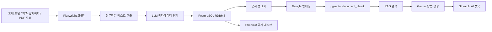
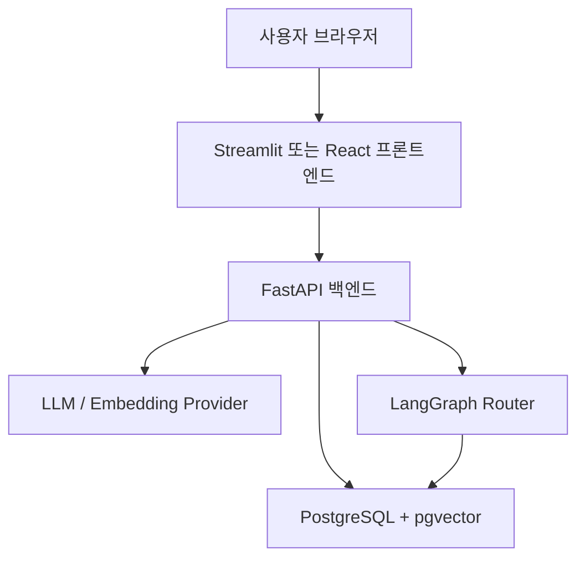
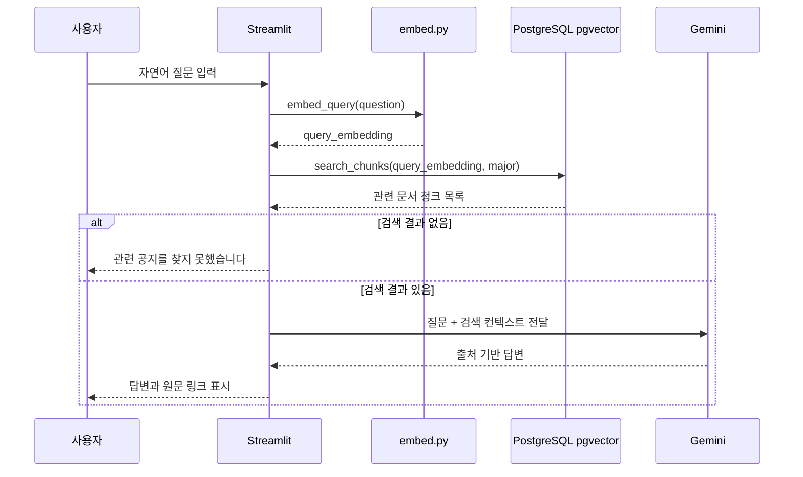
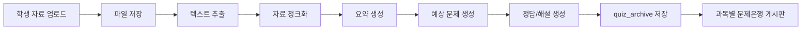
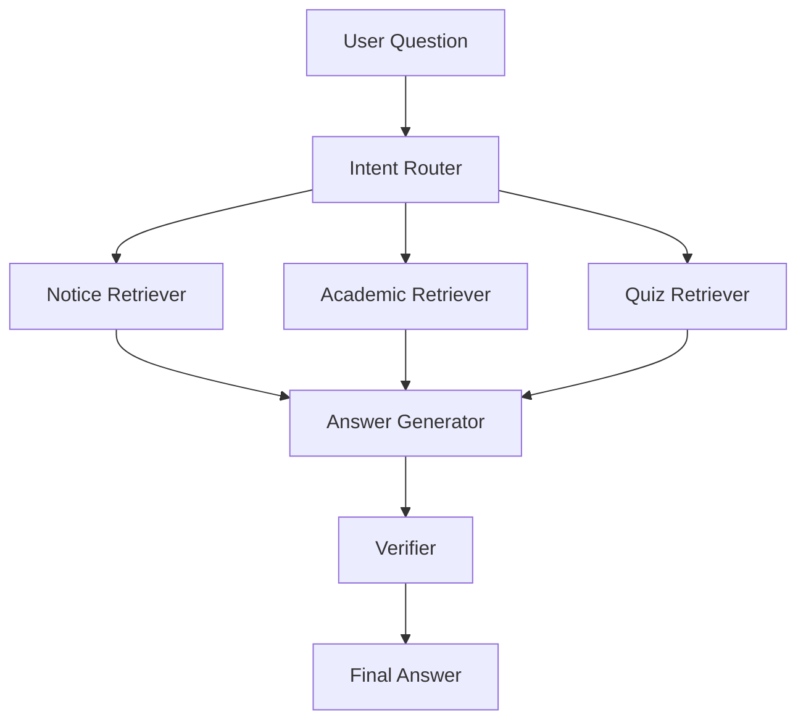

# KNU AI Assistant

공주대학교 학생을 위한 확장형 RDBMS 웹앱 및 RAG 기반 교내 통합 지능형 학생 비서 플랫폼

## 문서 정보

| 항목 | 내용 |
| --- | --- |
| 문서 유형 | 프로젝트 상세 명세서 |
| 문서 기준일 | 2026-05-14 |
| 프로젝트 상태 | 공지 크롤링, 메타데이터 정제, RDBMS 적재, pgvector 기반 검색, Streamlit 게시판 및 챗봇 프로토타입 구현 진행 중 |
| 과제명 | 확장형 RDBMS 웹앱 및 RAG 기반 교내 통합 지능형 학생 비서 플랫폼 |
| 핵심 키워드 | 교내 공지 큐레이션, RDBMS, pgvector, RAG, 학생 개인화, 학습 보조, 문제은행 |

## 목차

1. [프로젝트 개요](#1-프로젝트-개요)
2. [문제 정의와 해결 방향](#2-문제-정의와-해결-방향)
3. [사용자와 활용 시나리오](#3-사용자와-활용-시나리오)
4. [핵심 기능 명세](#4-핵심-기능-명세)
5. [시스템 아키텍처](#5-시스템-아키텍처)
6. [현재 구현 모듈](#6-현재-구현-모듈)
7. [데이터 파이프라인 명세](#7-데이터-파이프라인-명세)
8. [데이터베이스 명세](#8-데이터베이스-명세)
9. [RAG 검색 및 답변 생성 명세](#9-rag-검색-및-답변-생성-명세)
10. [웹앱 UI 명세](#10-웹앱-ui-명세)
11. [AI 학습 보조 및 문제은행 확장 명세](#11-ai-학습-보조-및-문제은행-확장-명세)
12. [라우팅 에이전트 확장 명세](#12-라우팅-에이전트-확장-명세)
13. [기술 스택과 실행 환경](#13-기술-스택과-실행-환경)
14. [설치 및 실행 방법](#14-설치-및-실행-방법)
15. [개발 컨벤션](#15-개발-컨벤션)
16. [품질 기준과 검증 계획](#16-품질-기준과-검증-계획)
17. [보안, 개인정보, 데이터 거버넌스](#17-보안-개인정보-데이터-거버넌스)
18. [로드맵](#18-로드맵)
19. [리스크와 대응 전략](#19-리스크와-대응-전략)
20. [최종 산출물 정의](#20-최종-산출물-정의)

## 1. 프로젝트 개요

### 1.1 한 줄 정의

KNU AI Assistant는 공주대학교의 공지사항, 학사 정보, 학과 자료, 학생 업로드 학습 자료를 RDBMS에 구조화하여 적재하고, 이를 기반으로 개인화 게시판과 출처 기반 RAG 챗봇을 제공하는 교내 지능형 학생 비서 플랫폼이다.

### 1.2 프로젝트 목표

이 프로젝트의 목표는 단순 챗봇을 만드는 것이 아니라, 교내 데이터를 지속적으로 수집, 정제, 저장, 검색, 확장할 수 있는 데이터 중심 플랫폼을 구축하는 것이다. 초기에는 공지사항 큐레이션과 RAG 챗봇을 중심으로 구현하고, 이후 전공 수업 자료 기반 문제 생성 및 과목별 문제은행으로 확장한다.

### 1.3 핵심 가치

| 가치 | 설명 |
| --- | --- |
| 정보 탐색 비용 절감 | 학생이 수십 개의 무관한 공지를 직접 열람하지 않아도 필요한 공지를 빠르게 확인한다. |
| 개인화 | 소속 학과, 학년, 관심 키워드에 따라 우선순위가 높은 정보를 노출한다. |
| 출처 기반 신뢰성 | RAG 답변은 RDBMS와 pgvector에 적재된 검증 데이터만 사용하고, 원문 URL을 함께 제공한다. |
| 확장성 | 데이터와 UI, 챗봇을 분리해 향후 FastAPI, 모바일 앱, 교내 공식 시스템 연동이 가능하도록 설계한다. |
| 학습 지원 | 수업 자료 업로드, 예상 문제 생성, 과목별 문제 공유 기능으로 시험 기간에도 활용할 수 있는 서비스를 지향한다. |

### 1.4 현재 구현 범위

현재 프로젝트는 다음 범위를 중심으로 구현되어 있다.

- 공주대학교 일반 공지 크롤링
- 컴퓨터공학과 학과공지 크롤링
- 컴퓨터공학과 교과과정표 PDF 결정론적 파싱
- 본문 이미지 및 첨부파일 텍스트 추출
- LLM 기반 공지 메타데이터 정규화
- PostgreSQL + pgvector 기반 문서, 첨부, 청크, 임베딩 저장
- Streamlit 기반 공지 게시판
- Streamlit 기반 RAG 챗봇 프로토타입

### 1.5 현재 미구현 또는 확장 예정 범위

- FastAPI 백엔드 분리
- LangGraph 기반 질문 라우팅 에이전트
- 사용자 계정 및 프로필 영구 저장 UI
- PDF 업로드 기반 학습 자료 분석
- 예상 문제 자동 생성
- 과목별 문제은행 게시판
- 관리자 검수 화면
- 배포 환경 구성

## 2. 문제 정의와 해결 방향

### 2.1 문제 정의

공주대학교 포털과 학과 홈페이지에는 일반 공지, 학사 공지, 장학 공지, 취업 정보, 행사 안내, 프로그램 모집 글이 지속적으로 게시된다. 그러나 대부분의 정보는 학과, 학년, 관심사와 무관하게 한곳에 혼재되어 있어 학생은 자신에게 필요한 정보를 찾기 위해 많은 시간을 소비한다.

대표적인 문제는 다음과 같다.

| 문제 | 상세 설명 |
| --- | --- |
| 정보 과부하 | 모든 단과대, 학과, 부서의 공지가 한 화면에 섞여 학생이 무관한 글을 계속 열람해야 한다. |
| 탐색 피로도 | 제목만으로 대상 여부를 알기 어려워 본문과 첨부파일까지 직접 확인해야 한다. |
| 혜택 누락 | 시험 기간이나 과제 기간처럼 바쁜 시기에 포털 확인을 미루면 장학금, 프로그램, 채용 기회를 놓칠 수 있다. |
| 검색 품질 한계 | 단순 키워드 검색은 표현이 조금만 달라져도 필요한 공지를 찾기 어렵다. |
| 학습 자료 활용 비효율 | 전공 PDF, 강의자료, 공지 첨부파일을 학생이 직접 요약하고 예상 문제를 만드는 데 시간이 많이 든다. |

### 2.2 해결 방향

이 프로젝트는 단일 챗봇 인터페이스만으로 모든 문제를 해결하려 하지 않는다. 먼저 웹앱과 RDBMS 중심의 데이터 적재 구조를 만든 뒤, 그 위에 챗봇과 학습 보조 기능을 연결한다.

핵심 해결 전략은 다음과 같다.

1. 교내 공지와 학과 자료를 자동 크롤링한다.
2. 본문, 이미지, PDF, HWPX, 첨부파일을 텍스트화한다.
3. LLM을 사용해 카테고리, 대상, 마감일, 키워드를 정규화한다.
4. 정제된 데이터를 RDBMS에 저장한다.
5. 문서를 청크로 나누고 임베딩하여 pgvector에 저장한다.
6. 웹 게시판에서 학과와 카테고리 기준으로 개인화 필터링한다.
7. 챗봇은 RDBMS에 저장된 데이터만 검색해 출처 기반 답변을 생성한다.
8. 추후 학생 업로드 자료를 분석해 예상 문제와 문제은행을 생성한다.

### 2.3 기존 방식 대비 차별점

| 구분 | 기존 포털 | 단일 챗봇 접근 | 본 프로젝트 |
| --- | --- | --- | --- |
| 데이터 구조 | 게시판 중심 비정형 데이터 | 대화 로그 중심 | RDBMS 중심 정형 데이터 |
| 검색 방식 | 키워드 검색 | LLM 응답 의존 | SQL 필터링 + 벡터 검색 |
| 출처 제공 | 원문 게시글 직접 확인 필요 | 누락 가능 | 답변마다 원문 제목과 URL 제공 |
| 확장성 | 포털 내부 기능에 의존 | 챗봇 기능에 종속 | API, 웹앱, 챗봇, 문제은행으로 확장 가능 |
| 개인화 | 제한적 | 대화 중 추론 | 사용자 프로필 기반 필터링 |

## 3. 사용자와 활용 시나리오

### 3.1 주요 사용자

| 사용자 | 요구사항 |
| --- | --- |
| 일반 학생 | 장학금, 수강신청, 취업, 행사 공지를 빠르게 확인하고 싶다. |
| 특정 학과 학생 | 자기 학과 홈페이지의 공지까지 통합해서 보고 싶다. |
| 시험 준비 학생 | 강의자료를 업로드해 핵심 개념과 예상 문제를 얻고 싶다. |
| 프로젝트 운영자 | 크롤러를 추가하고 데이터 품질을 관리하고 싶다. |
| 교내 서비스 확장 담당자 | 추후 API 또는 앱 연동 가능한 구조를 원한다. |

### 3.2 대표 사용자 시나리오

#### 시나리오 A: 맞춤형 공지 확인

1. 학생이 웹앱에 접속한다.
2. 사이드바에서 학과를 선택한다.
3. 게시판은 해당 학과에 직접 해당하거나 전체 학생 대상인 공지만 우선 노출한다.
4. 학생은 장학/등록, 학사/수업, 진로/취업 등 카테고리로 추가 필터링한다.
5. 필요한 공지를 클릭해 원문으로 이동한다.

#### 시나리오 B: 자연어 공지 검색

1. 학생이 "컴퓨터공학과 학생이 신청할 수 있는 장학금 알려줘"라고 입력한다.
2. 시스템은 질문을 임베딩한다.
3. `document_chunk`의 벡터와 코사인 유사도를 계산한다.
4. 학과 필터 조건에 맞는 문서 중 가장 관련 높은 청크를 찾는다.
5. 챗봇은 검색된 컨텍스트만 근거로 답변하고 원문 URL을 제공한다.

#### 시나리오 C: 교과과정 질의

1. 학생이 "컴퓨터공학과 3학년 1학기 전공필수 과목 알려줘"라고 질문한다.
2. 시스템은 컴퓨터공학과 교과과정표 문서를 검색한다.
3. PDF에서 결정론적으로 파싱된 교육과정 데이터를 기반으로 답변한다.
4. 추후 LangGraph 라우터가 도입되면 질문 의도를 학사 정보로 분류해 공지 검색과 구분한다.

#### 시나리오 D: 수업 자료 기반 예상 문제 생성

1. 학생이 특정 과목의 PDF 강의자료를 업로드한다.
2. 시스템은 파일을 텍스트로 추출하고 과목 정보를 연결한다.
3. LLM이 핵심 개념, 요약, 예상 문제, 정답, 해설을 생성한다.
4. 생성 결과는 과목별 문제은행에 저장된다.
5. 같은 과목을 수강하는 학생이 게시판에서 문제를 확인한다.

## 4. 핵심 기능 명세

### 4.1 스마트 공지사항 보드

#### 목적

교내 공지 데이터를 자동 수집하고, 학생의 학과와 관심 조건에 따라 노이즈 없는 게시판을 제공한다.

#### 현재 구현

- `main_notice.py`: 공주대학교 일반 공지 5페이지 수집
- `cse_notice.py`: 컴퓨터공학과 학과공지 5페이지 및 고정글 수집
- `cse_curriculum.py`: 컴퓨터공학과 교과과정표 PDF 수집 및 파싱
- `app.py`: Streamlit 탭 기반 게시판 UI
- `db.py`: `get_documents`, `search_chunks`를 통한 목록 및 검색 조회

#### 기능 요구사항

| ID | 요구사항 |
| --- | --- |
| NB-001 | 시스템은 여러 소스의 공지를 하나의 통합 테이블에 저장해야 한다. |
| NB-002 | 공지는 카테고리, 대상, 키워드, 시작일, 마감일, 원문 URL을 가져야 한다. |
| NB-003 | 사용자는 학과를 선택해 자신에게 관련 있는 공지를 우선 확인할 수 있어야 한다. |
| NB-004 | 사용자는 카테고리별로 공지를 필터링할 수 있어야 한다. |
| NB-005 | 사용자는 자연어 검색어로 공지를 검색할 수 있어야 한다. |
| NB-006 | 검색 결과는 문서 중복 없이 문서당 가장 관련 높은 청크를 기준으로 표시되어야 한다. |
| NB-007 | 모든 공지 제목은 원문 URL로 연결되어야 한다. |
| NB-008 | 데이터가 없거나 검색에 실패하면 사용자에게 명확한 안내 메시지를 제공해야 한다. |

#### 카테고리 체계

현재 지원하는 대분류는 다음 5개이다.

- `장학/등록`
- `학사/수업`
- `진로/취업`
- `행사/공모전`
- `일반/기타`

#### 개인화 노출 규칙

사용자의 학과가 설정된 경우 다음 조건 중 하나를 만족하는 문서를 노출한다.

```sql
s.department = :major
OR :major = ANY(d.target)
OR '전체' = ANY(d.target)
```

이 규칙은 학과 사이트에서 수집한 글이 본문에 학과명을 명시하지 않아 `target = ['전체']`로 정제되는 경우에도 해당 학과 학생에게 노출되도록 하기 위한 것이다.

### 4.2 통합 지능형 챗봇

#### 목적

학생의 질문에 대해 RDBMS에 적재된 검증 데이터만 활용해 답변하고, 반드시 참고한 공지 제목과 URL을 제공한다.

#### 현재 구현

- Streamlit의 `AI 챗봇` 탭에서 질문 입력
- `embed_query()`로 질문 임베딩
- `search_chunks()`로 관련 문서 청크 검색
- Gemini 2.5 Flash로 컨텍스트 기반 답변 생성
- 컨텍스트가 없으면 "관련 공지를 찾지 못했습니다" 반환

#### 기능 요구사항

| ID | 요구사항 |
| --- | --- |
| CB-001 | 챗봇은 사용자의 현재 학과 설정을 검색 필터에 반영해야 한다. |
| CB-002 | 챗봇은 RDBMS에서 검색된 컨텍스트만 근거로 답변해야 한다. |
| CB-003 | 컨텍스트에 없는 정보는 추측하지 않아야 한다. |
| CB-004 | 답변 끝에는 참고한 공지 제목과 URL을 포함해야 한다. |
| CB-005 | 관련 문서가 없으면 정보 부재를 명확히 알려야 한다. |
| CB-006 | 답변 생성 실패 시 오류를 사용자에게 표시하고 대화 기록에 남겨야 한다. |

#### 답변 원칙

챗봇은 다음 원칙을 따른다.

- 한국어로 답변한다.
- 공지 원문과 첨부 텍스트에 없는 내용은 생성하지 않는다.
- 날짜, 대상, 신청 방법, 링크는 컨텍스트에 있는 경우에만 말한다.
- 불확실한 경우 원문 확인을 유도한다.
- 답변은 간결하되 핵심 정보를 빠뜨리지 않는다.

### 4.3 데이터 수집 및 메타데이터 정제

#### 목적

비정형 교내 데이터를 검색 가능한 정형 데이터로 변환한다.

#### 기능 요구사항

| ID | 요구사항 |
| --- | --- |
| DP-001 | 크롤러는 공통 `NoticeRecord` 형식의 데이터를 반환해야 한다. |
| DP-002 | 각 크롤러는 소스 식별 상수 5개를 정의해야 한다. |
| DP-003 | 첨부파일과 본문 이미지는 공통 어댑터를 사용해 텍스트화해야 한다. |
| DP-004 | LLM 정제 단계는 제목, 본문, URL을 원본으로 보존해야 한다. |
| DP-005 | LLM은 대상, 날짜, 카테고리, 키워드만 정규화해야 한다. |
| DP-006 | 정형 데이터는 `pre_refined=True`로 LLM 정제 단계를 우회할 수 있어야 한다. |
| DP-007 | 모든 문서는 청크화 후 임베딩되어 `document_chunk`에 저장되어야 한다. |

### 4.4 첨부파일 처리

#### 목적

공지 본문뿐 아니라 이미지와 첨부파일 내부의 정보까지 검색 대상으로 포함한다.

#### 지원 형식

| 형식 | 처리 방식 | 현재 상태 |
| --- | --- | --- |
| 본문 이미지 | Gemini VLM OCR 후 텍스트 추출 | 구현 |
| 이미지 첨부 | 이미지 바이트 보존, VLM OCR | 구현 |
| 텍스트 PDF | `pdfplumber` 텍스트 추출 | 구현 |
| 스캔 PDF | `pdf2image` 렌더링 후 VLM OCR | 구현 |
| HWPX | synapView 미리보기 또는 ZIP XML 파싱 | 구현 |
| HWP | synapView 미리보기 시도, 바이너리 직접 파싱 미지원 | 부분 지원 |
| XLSX/XLS | 현재 임베딩 제외 안내문 저장 | 제한 지원 |
| 기타 | 지원하지 않는 확장자로 표시 | 구현 |

#### 첨부 처리 원칙

- 첨부 처리 실패가 전체 크롤링 실패로 이어지지 않도록 한다.
- 실패 사유는 텍스트로 남겨 추후 운영자가 확인할 수 있게 한다.
- 이미지 원본은 `crawl_result/assets/<sha1>.<ext>` 경로로 저장해 중복을 줄인다.
- 운영 환경에서는 로컬 경로 대신 S3 등 외부 스토리지로 대체할 수 있다.

### 4.5 컴퓨터공학과 교과과정표 처리

#### 목적

교과과정표처럼 한 글자 오류도 치명적인 정형 학사 데이터는 LLM 추출을 사용하지 않고 결정론적으로 파싱한다.

#### 현재 구현

- `cse_curriculum.py`가 PDF를 다운로드한다.
- `curriculum_parser.py`가 `pdfplumber.extract_tables()` 결과를 파싱한다.
- PDF의 여러 연도 페이지를 `extra.curriculum.years[]`에 보존한다.
- 최신 연도 데이터는 사람이 읽기 좋은 텍스트로 렌더링해 임베딩한다.

#### 처리 원칙

- 과목명, 학점, 학기 정보는 LLM으로 재작성하지 않는다.
- 분류 컬럼은 forward-fill하되 학점 셀은 보정하지 않는다.
- 표 구조가 깨지면 파서 오류를 드러내고 임의 추론하지 않는다.
- 전체 원본 구조는 JSONB `extra`에 보존한다.

## 5. 시스템 아키텍처

### 5.1 전체 구조



### 5.2 계층별 책임

| 계층 | 책임 | 관련 파일 |
| --- | --- | --- |
| 수집 계층 | 포털, 학과 홈페이지, PDF에서 원천 데이터를 수집 | `crawlers/` |
| 첨부 처리 계층 | 이미지, PDF, HWPX 등 비정형 자산을 텍스트로 변환 | `attachments.py` |
| 정제 계층 | LLM 또는 결정론 파서로 메타데이터를 표준화 | `refine.py`, `schema.py`, `curriculum_parser.py` |
| 저장 계층 | 소스, 문서, 자산, 청크, 사용자 정보를 RDBMS에 저장 | `db.py` |
| 임베딩 계층 | 문서 청크와 질문을 벡터로 변환 | `embed.py` |
| 서비스 계층 | 게시판, 검색, 챗봇 UI 제공 | `app.py` |
| 배치 진입점 | 수집부터 적재까지 일괄 실행 | `main.py` |

### 5.3 2-Phase 아키텍처

초기부터 챗봇만 구현하면 데이터 품질 관리, 확장, 원문 추적이 어렵다. 따라서 본 프로젝트는 다음 순서로 설계한다.

1. 웹앱과 RDBMS 중심의 데이터 적재 체계를 먼저 구축한다.
2. 검증된 데이터베이스를 기반으로 챗봇과 RAG 기능을 연결한다.
3. 이후 업로드 자료, 문제은행, 라우팅 에이전트로 확장한다.

### 5.4 향후 서비스 분리 구조

현재는 Streamlit이 `db.py`를 직접 호출한다. 추후 서비스 규모가 커지면 다음과 같이 분리한다.



FastAPI 도입 시 기대 효과는 다음과 같다.

- 웹앱과 챗봇 로직 분리
- 모바일 앱 또는 외부 서비스 API 제공
- 인증, 권한, 관리자 기능 확장
- 배치 작업과 사용자 요청 처리 분리

## 6. 현재 구현 모듈

### 6.1 파일 구조

```text
.
├── app.py
├── attachments.py
├── curriculum_parser.py
├── db.py
├── docker-compose.yml
├── Dockerfile
├── embed.py
├── main.py
├── model.py
├── refine.py
├── requirements.txt
├── schema.py
├── crawlers/
│   ├── __init__.py
│   ├── cse_curriculum.py
│   ├── cse_notice.py
│   └── main_notice.py
└── crawl_result/
    ├── assets/
    └── cse_curriculum/
```

### 6.2 모듈별 상세 역할

| 파일 | 역할 |
| --- | --- |
| `main.py` | 전체 배치 실행 진입점. DB 초기화, 소스 등록, 크롤링, 정제, 문서 저장, 자산 저장, 청크 임베딩 저장을 순차 실행한다. |
| `app.py` | Streamlit UI. 사용자 학과 선택, 공지 게시판, 자연어 검색, AI 챗봇 기능을 제공한다. |
| `db.py` | PostgreSQL 연결, 테이블 생성, 문서 UPSERT, 자산 삽입, 청크 삽입, 목록 조회, 벡터 검색을 담당한다. |
| `embed.py` | 문서 청크 분할과 Google Generative AI Embeddings 호출을 담당한다. |
| `refine.py` | 크롤링 결과를 `MetadataSchema`에 맞게 정제한다. `pre_refined` 데이터는 LLM 호출을 우회한다. |
| `schema.py` | LLM 구조화 출력에 사용하는 Pydantic 스키마를 정의한다. |
| `model.py` | Gemini 2.5 Flash 모델 클라이언트를 생성한다. |
| `attachments.py` | 공지 첨부파일과 본문 이미지를 텍스트화한다. |
| `curriculum_parser.py` | 교과과정표 PDF 표 데이터를 결정론적으로 파싱한다. |
| `crawlers/main_notice.py` | 공주대학교 일반 공지 게시판을 수집한다. |
| `crawlers/cse_notice.py` | 컴퓨터공학과 학과공지 게시판을 수집한다. |
| `crawlers/cse_curriculum.py` | 컴퓨터공학과 교과과정표 PDF를 수집하고 정형 데이터로 반환한다. |

### 6.3 현재 데이터 소스

| 소스 코드 | 이름 | 종류 | 학과 | 상태 |
| --- | --- | --- | --- | --- |
| `main_notice` | 공주대학교 일반 공지 | `notice` | 없음 | 구현 |
| `cse_notice` | 컴퓨터공학과 학과공지 | `notice` | 컴퓨터공학과 | 구현 |
| `cse_curriculum` | 컴퓨터공학과 교과과정표 | `academic` | 컴퓨터공학과 | 구현 |

## 7. 데이터 파이프라인 명세

### 7.1 배치 처리 흐름

`main.py`는 다음 순서로 실행된다.

1. `init_db()`로 테이블과 인덱스를 준비한다.
2. `CRAWLERS` 레지스트리에 등록된 크롤러 모듈을 순회한다.
3. 각 크롤러의 상수 정보를 `source` 테이블에 UPSERT한다.
4. 크롤러의 `crawling()` 함수를 실행한다.
5. 크롤링 결과를 `refine()`으로 정제한다.
6. `document` 테이블에 문서를 UPSERT한다.
7. `document_asset` 테이블에 자산을 저장한다.
8. 문서 제목과 본문을 합친 텍스트를 청크화한다.
9. 청크별 임베딩을 생성한다.
10. `document_chunk` 테이블에 청크와 벡터를 저장한다.

### 7.2 크롤러 공통 상수

모든 크롤러 파일은 다음 상수를 정의해야 한다.

```python
SOURCE_CODE = "cse_notice"
SOURCE_NAME = "컴퓨터공학과 학과공지"
DEPARTMENT = "컴퓨터공학과"
KIND = "notice"
BASE_URL = "https://computer.kongju.ac.kr"
```

| 상수 | 설명 |
| --- | --- |
| `SOURCE_CODE` | DB에서 소스를 고유 식별하는 코드. `source.code`에 저장된다. |
| `SOURCE_NAME` | 사용자에게 보여줄 소스명. |
| `DEPARTMENT` | 특정 학과 소스인 경우 학과명. 전체 학교 소스는 `None`. |
| `KIND` | `notice` 또는 `academic`. |
| `BASE_URL` | 상대 URL을 절대 URL로 변환할 때 사용하는 기준 URL. |

### 7.3 크롤러 반환 스키마

크롤러의 `crawling()` 함수는 `list[NoticeRecord]`를 반환한다.

```python
NoticeRecord = {
    "title": str,
    "date": str,
    "content": str,
    "url": str,
    "assets": list[AssetMeta],

    # 정형 데이터에서만 선택적으로 사용
    "pre_refined": bool,
    "metadata": dict,
    "extra": dict,
}
```

필드 설명은 다음과 같다.

| 필드 | 필수 | 설명 |
| --- | --- | --- |
| `title` | 예 | 게시글 제목 |
| `date` | 예 | 원문에 표시된 등록일 또는 날짜 문자열 |
| `content` | 예 | 본문, 본문 이미지 OCR 결과, 첨부파일 추출 텍스트를 합친 원문 중심 텍스트 |
| `url` | 예 | 게시글 또는 자료의 절대 URL |
| `assets` | 예 | 본문 이미지와 첨부파일 메타데이터 목록 |
| `pre_refined` | 아니오 | LLM 정제를 우회할지 여부 |
| `metadata` | 아니오 | `pre_refined=True`일 때 직접 제공하는 정제 메타데이터 |
| `extra` | 아니오 | JSONB로 저장할 비정형 확장 데이터 |

### 7.4 자산 메타데이터 스키마

```python
AssetMeta = {
    "kind": "inline_image"
          | "attachment_image"
          | "attachment_pdf"
          | "attachment_hwpx"
          | "attachment_xlsx"
          | "attachment_other",
    "filename": str | None,
    "source_url": str,
    "storage_path": str | None,
    "mime_type": str | None,
    "extracted_text": str,
    "order_idx": int,
}
```

### 7.5 LLM 메타데이터 정제 스키마

`schema.py`의 `MetadataSchema`는 다음 필드를 갖는다.

| 필드 | 타입 | 설명 |
| --- | --- | --- |
| `title` | `str` | 게시글 제목. 최종 저장 시 크롤러 원본으로 덮어쓴다. |
| `content` | `str` | 게시글 본문. 최종 저장 시 크롤러 원본으로 덮어쓴다. |
| `target` | `list[str]` | 참여 가능한 학과, 학년, 학적 상태. 없으면 `["전체"]`. |
| `start_date` | `str | None` | 접수 시작일. `yyyy-mm-dd` 형식. |
| `end_date` | `str | None` | 접수 마감일. `yyyy-mm-dd` 형식. |
| `category` | `Literal[...]` | 5개 대분류 중 하나. |
| `keywords` | `list[str]` | 핵심 주제 또는 관심 키워드 1개에서 3개. |
| `url` | `str` | 원문 URL. 최종 저장 시 크롤러 원본으로 덮어쓴다. |

### 7.6 target 추출 규칙

`target`은 개인화 필터링에 직접 사용되므로 엄격하게 추출한다.

#### target에 포함할 수 있는 값

- 학과명: `컴퓨터공학과`, `전자공학과`, `공과대학`
- 학년: `1학년`, `3학년`, `졸업예정자`
- 학적 상태: `재학생`, `휴학생`, 단 학교 단위로 명시된 경우만

#### target에 포함하지 않는 값

- 나이: `19세~39세`, `만 35세 이하`
- 지역 또는 거주 조건: `대구 거주자`, `수도권 외 지역`
- 직업 또는 직장 상태: `재직자`, `구직자`, `프리랜서`
- 관심사: `AI에 관심 있는 학생`, `창업 관심자`
- 국적, 성별, 소득 등 기타 인구통계 조건

학과 또는 학년 제한이 본문에 명시되지 않았다면 무조건 `["전체"]`로 저장한다.

### 7.7 청크화 및 임베딩 정책

| 항목 | 값 |
| --- | --- |
| 청크 크기 | 800자 |
| 청크 overlap | 100자 |
| 임베딩 모델 | `gemini-embedding-2-preview` |
| 임베딩 차원 | 3072 |
| 벡터 인덱스 | pgvector HNSW |
| 거리 연산 | cosine distance, `vector_cosine_ops` |

청크는 `문서 제목 + 본문`을 대상으로 생성한다. 이렇게 하면 제목에만 등장하는 핵심 키워드도 검색에 반영된다.

## 8. 데이터베이스 명세

### 8.1 데이터베이스 선택

본 프로젝트는 PostgreSQL 16과 pgvector를 사용한다.

#### 선택 이유

- 공지, 첨부, 청크, 소스, 사용자 프로필 간 관계를 RDBMS로 명확하게 표현할 수 있다.
- SQL 필터링과 벡터 검색을 같은 데이터베이스에서 처리할 수 있다.
- 학과, 카테고리, 마감일, 대상 조건과 벡터 유사도를 조합할 수 있다.
- FAISS나 Chroma 같은 별도 벡터 DB 없이 운영 구조를 단순화할 수 있다.

### 8.2 테이블 개요

| 테이블 | 역할 |
| --- | --- |
| `source` | 크롤링 소스 메타데이터 |
| `document` | 공지, 학사 자료, 교과과정표 등 문서 본체 |
| `document_asset` | 본문 이미지, 첨부파일 등 문서 자산 |
| `document_chunk` | RAG 검색용 청크와 임베딩 |
| `users` | 학생 프로필 |

### 8.3 `source`

소스 단위의 메타데이터를 저장한다.

| 컬럼 | 타입 | 제약 | 설명 |
| --- | --- | --- | --- |
| `id` | `BIGSERIAL` | PK | 내부 식별자 |
| `code` | `VARCHAR(50)` | UNIQUE, NOT NULL | 크롤러 소스 코드 |
| `name` | `VARCHAR(100)` | NOT NULL | 소스 표시명 |
| `kind` | `VARCHAR(20)` | NOT NULL | `notice` 또는 `academic` |
| `department` | `VARCHAR(100)` | nullable | 특정 학과 소스의 학과명 |
| `base_url` | `VARCHAR(500)` | nullable | 소스 기준 URL |
| `created_at` | `TIMESTAMPTZ` | default now | 생성 시각 |

### 8.4 `document`

공지와 학사 자료의 본문 및 정규화 메타데이터를 저장한다.

| 컬럼 | 타입 | 제약 | 설명 |
| --- | --- | --- | --- |
| `id` | `BIGSERIAL` | PK | 내부 식별자 |
| `source_id` | `BIGINT` | FK, NOT NULL | `source.id` 참조 |
| `url` | `VARCHAR(500)` | UNIQUE, NOT NULL | 원문 URL |
| `title` | `VARCHAR(255)` | NOT NULL | 제목 |
| `content` | `TEXT` | NOT NULL | 본문과 첨부 추출 텍스트 |
| `start_date` | `DATE` | nullable | 접수 시작일 |
| `end_date` | `DATE` | nullable | 접수 마감일 |
| `category` | `VARCHAR(50)` | nullable | 대분류 카테고리 |
| `target` | `VARCHAR(100)[]` | nullable | 대상 학과, 학년, 학적 상태 |
| `keywords` | `VARCHAR(50)[]` | nullable | 핵심 키워드 |
| `extra` | `JSONB` | nullable | 소스별 확장 데이터 |
| `crawled_at` | `TIMESTAMPTZ` | default now | 최초 수집 시각 |
| `updated_at` | `TIMESTAMPTZ` | default now | 갱신 시각 |

주요 인덱스는 다음과 같다.

- `idx_document_source`
- `idx_document_category`
- `idx_document_end_date`

### 8.5 `document_asset`

문서에 포함된 이미지와 첨부파일 메타데이터를 저장한다.

| 컬럼 | 타입 | 제약 | 설명 |
| --- | --- | --- | --- |
| `id` | `BIGSERIAL` | PK | 내부 식별자 |
| `document_id` | `BIGINT` | FK, NOT NULL | `document.id` 참조 |
| `kind` | `VARCHAR(30)` | NOT NULL | 자산 종류 |
| `filename` | `VARCHAR(300)` | nullable | 첨부파일명 |
| `source_url` | `VARCHAR(800)` | NOT NULL | 원본 다운로드 또는 이미지 URL |
| `storage_path` | `VARCHAR(800)` | nullable | 로컬 저장 경로 |
| `mime_type` | `VARCHAR(80)` | nullable | MIME 타입 |
| `extracted_text` | `TEXT` | nullable | 추출된 텍스트 |
| `order_idx` | `INT` | default 0 | 문서 내 순서 |
| `created_at` | `TIMESTAMPTZ` | default now | 생성 시각 |

### 8.6 `document_chunk`

RAG 검색을 위한 텍스트 청크와 벡터를 저장한다.

| 컬럼 | 타입 | 제약 | 설명 |
| --- | --- | --- | --- |
| `id` | `BIGSERIAL` | PK | 내부 식별자 |
| `document_id` | `BIGINT` | FK, NOT NULL | `document.id` 참조 |
| `chunk_idx` | `INT` | NOT NULL | 문서 내 청크 순서 |
| `content` | `TEXT` | NOT NULL | 청크 텍스트 |
| `source_asset_id` | `BIGINT` | FK nullable | 특정 자산에서 나온 청크일 경우 연결 |
| `embedding` | `vector(3072)` | NOT NULL | 임베딩 벡터 |
| `created_at` | `TIMESTAMPTZ` | default now | 생성 시각 |

제약과 인덱스는 다음과 같다.

- `UNIQUE(document_id, chunk_idx)`
- `idx_document_chunk_document`
- `idx_document_chunk_embedding` using HNSW `vector_cosine_ops`

### 8.7 `users`

학생 개인화 필터링을 위한 프로필 테이블이다.

| 컬럼 | 타입 | 제약 | 설명 |
| --- | --- | --- | --- |
| `student_id` | `VARCHAR(20)` | PK | 학번 또는 사용자 식별자 |
| `major` | `VARCHAR(50)` | nullable | 소속 학과 |
| `name` | `VARCHAR(50)` | nullable | 이름 |
| `interests` | `TEXT` | nullable | 관심 키워드 |
| `courses` | `TEXT` | nullable | 수강 과목 |

현재 Streamlit UI는 사이드바 선택값을 세션 상태로 사용하며, `users` 테이블 기반 프로필 저장 UI는 확장 예정이다.

### 8.8 향후 문제은행 확장 테이블 제안

AI 학습 보조 기능을 위해 다음 테이블을 추가할 수 있다.

#### `course`

| 컬럼 | 타입 | 설명 |
| --- | --- | --- |
| `id` | `BIGSERIAL` | 과목 식별자 |
| `department` | `VARCHAR(100)` | 개설 학과 |
| `course_code` | `VARCHAR(50)` | 과목 코드 |
| `course_name` | `VARCHAR(200)` | 과목명 |
| `professor` | `VARCHAR(100)` | 담당 교수 |
| `semester` | `VARCHAR(30)` | 학기 |

#### `uploaded_material`

| 컬럼 | 타입 | 설명 |
| --- | --- | --- |
| `id` | `BIGSERIAL` | 업로드 자료 식별자 |
| `course_id` | `BIGINT` | 과목 참조 |
| `uploader_id` | `VARCHAR(20)` | 업로드 학생 |
| `filename` | `VARCHAR(300)` | 파일명 |
| `storage_path` | `VARCHAR(800)` | 저장 경로 |
| `extracted_text` | `TEXT` | 추출 텍스트 |
| `created_at` | `TIMESTAMPTZ` | 업로드 시각 |

#### `quiz_archive`

| 컬럼 | 타입 | 설명 |
| --- | --- | --- |
| `id` | `BIGSERIAL` | 문제 묶음 식별자 |
| `course_id` | `BIGINT` | 과목 참조 |
| `material_id` | `BIGINT` | 원본 자료 참조 |
| `title` | `VARCHAR(255)` | 문제 묶음 제목 |
| `summary` | `TEXT` | 핵심 요약 |
| `created_by` | `VARCHAR(20)` | 생성 요청 학생 |
| `created_at` | `TIMESTAMPTZ` | 생성 시각 |

#### `quiz_item`

| 컬럼 | 타입 | 설명 |
| --- | --- | --- |
| `id` | `BIGSERIAL` | 개별 문제 식별자 |
| `quiz_archive_id` | `BIGINT` | 문제 묶음 참조 |
| `question_type` | `VARCHAR(30)` | 객관식, 단답형, 서술형 등 |
| `question` | `TEXT` | 문제 |
| `choices` | `JSONB` | 객관식 보기 |
| `answer` | `TEXT` | 정답 |
| `explanation` | `TEXT` | 해설 |
| `difficulty` | `VARCHAR(20)` | 난이도 |
| `source_span` | `TEXT` | 원본 근거 구간 |

## 9. RAG 검색 및 답변 생성 명세

### 9.1 검색 흐름



### 9.2 벡터 검색 쿼리 특성

`search_chunks()`는 다음 원칙으로 검색한다.

- `document_chunk.embedding <=> query_embedding`으로 cosine distance 계산
- `1 - distance`를 유사도 점수로 사용
- `DISTINCT ON (d.id)`로 문서당 가장 관련 높은 청크 1개만 선택
- 선택 후 Python에서 score 내림차순 재정렬
- 학과 필터가 있으면 `source.department`, `document.target`, `전체` 조건을 함께 적용

### 9.3 답변 생성 프롬프트 정책

챗봇 시스템 프롬프트는 다음 정책을 강제한다.

- 공주대학교 학생을 돕는 AI 비서 역할을 한다.
- 제공된 공지사항 컨텍스트만 근거로 답한다.
- 컨텍스트에 없는 정보는 추측하지 않는다.
- 관련 정보가 없으면 "관련 공지를 찾지 못했습니다"라고 답한다.
- 답변 끝에 참고한 공지 제목과 URL을 목록으로 붙인다.
- 한국어로 간결하게 답한다.

### 9.4 할루시네이션 방지 전략

| 전략 | 설명 |
| --- | --- |
| 원천 데이터 제한 | 답변 생성 시 검색된 문서 청크만 컨텍스트로 제공한다. |
| 출처 의무화 | 답변 끝에 원문 제목과 URL을 포함하도록 한다. |
| 부재 응답 | 검색 결과가 없으면 답변을 생성하지 않고 부재 메시지를 반환한다. |
| 원본 보존 | LLM 정제 단계에서 본문을 요약하지 않고 크롤러 원본으로 덮어쓴다. |
| 정형 데이터 LLM 우회 | 교과과정표처럼 정확성이 중요한 데이터는 결정론 파서를 사용한다. |

### 9.5 검색 품질 개선 후보

향후 다음 개선을 적용할 수 있다.

- 마감일이 지나지 않은 공지 우선 정렬
- 사용자 관심 키워드 가중치 반영
- 카테고리별 검색 라우팅
- BM25와 벡터 검색을 결합한 하이브리드 검색
- 검색 결과 재순위화
- 답변 생성 전 verifier 단계 추가

## 10. 웹앱 UI 명세

### 10.1 현재 화면 구조

Streamlit 앱은 다음 구조를 가진다.

```text
사이드바
└── 내 프로필
    └── 학과 선택

메인
├── 공지사항 게시판 탭
│   ├── 검색 입력
│   ├── 카테고리 선택
│   └── 공지 목록
└── AI 챗봇 탭
    ├── 현재 학과 표시
    ├── 대화 기록
    └── 질문 입력
```

### 10.2 사이드바

| 요소 | 설명 |
| --- | --- |
| 학과 선택 | 사용자의 현재 학과를 선택한다. 검색과 게시판 필터에 반영된다. |
| 버전 캡션 | 프로토타입 버전과 기능 설명을 표시한다. |

현재 학과 목록은 공주대학교 주요 학과를 정적 리스트로 제공한다.

### 10.3 공지사항 게시판 탭

#### 입력 요소

| 요소 | 설명 |
| --- | --- |
| 공지사항 검색 | 자연어 검색어를 입력한다. 입력값이 있으면 벡터 검색 모드로 전환된다. |
| 카테고리 선택 | 전체 또는 5개 대분류 중 하나를 선택한다. |

#### 목록 표시 요소

각 공지는 다음 정보를 표시한다.

- 제목과 원문 링크
- 카테고리
- 대상
- 마감일
- 키워드
- 검색 모드일 경우 유사도 점수
- 소스명

### 10.4 AI 챗봇 탭

#### 입력 요소

| 요소 | 설명 |
| --- | --- |
| 질문 입력 | 공지, 학사, 장학, 취업 등 교내 정보 관련 질문을 입력한다. |

#### 상태 관리

- `st.session_state.chat_history`에 대화 기록을 저장한다.
- 사용자 메시지와 AI 응답을 순서대로 렌더링한다.
- 답변 생성 중 오류가 발생하면 오류 메시지를 대화 기록에 추가한다.

### 10.5 사용자 경험 요구사항

| ID | 요구사항 |
| --- | --- |
| UI-001 | 데이터가 없을 때 `main.py` 실행 필요 안내를 제공해야 한다. |
| UI-002 | 검색 실패나 답변 생성 실패는 사용자에게 명확히 표시해야 한다. |
| UI-003 | 학과 선택은 게시판과 챗봇에 일관되게 반영되어야 한다. |
| UI-004 | 원문 링크는 새 창 또는 브라우저에서 확인 가능한 절대 URL이어야 한다. |
| UI-005 | 장기적으로 모바일 화면에서도 공지 목록과 챗봇이 사용 가능해야 한다. |

## 11. AI 학습 보조 및 문제은행 확장 명세

### 11.1 기능 목적

공지 확인 기능은 평시 사용성을 담당하고, AI 학습 보조 기능은 시험 기간 사용성을 담당한다. 학생이 강의자료를 업로드하면 시스템이 핵심 내용을 추출하고 예상 문제를 생성하여 과목별 문제은행에 저장한다.

### 11.2 주요 기능

| ID | 기능 | 설명 |
| --- | --- | --- |
| QA-001 | 자료 업로드 | PDF, 텍스트, HWPX 등 수업 자료를 업로드한다. |
| QA-002 | 텍스트 추출 | 업로드 파일에서 본문을 추출한다. |
| QA-003 | 요약 생성 | 핵심 개념, 용어, 공식, 흐름을 요약한다. |
| QA-004 | 예상 문제 생성 | 객관식, 단답형, 서술형 문제를 생성한다. |
| QA-005 | 정답 및 해설 생성 | 각 문제에 정답과 근거 해설을 붙인다. |
| QA-006 | 과목별 아카이빙 | 생성 결과를 과목별 게시판에 저장한다. |
| QA-007 | 공유 및 재사용 | 같은 과목 수강생이 문제를 열람할 수 있다. |

### 11.3 문제 생성 정책

문제 생성 시 다음 원칙을 적용한다.

- 업로드 자료에 명시된 내용만 근거로 문제를 만든다.
- 원문 근거 구간 또는 페이지 정보를 함께 저장한다.
- 문제 유형과 난이도를 구분한다.
- 단순 암기형뿐 아니라 개념 비교, 적용, 오류 찾기 문제를 포함한다.
- 개인정보나 저작권 문제가 있는 자료는 공유 범위를 제한할 수 있어야 한다.

### 11.4 예상 처리 흐름



### 11.5 검수와 품질 관리

문제은행은 학생들이 함께 사용하는 기능이므로 다음 품질 관리 기능이 필요하다.

- 생성 문제 신고 기능
- 정답 오류 신고 기능
- 관리자 또는 작성자 수정 기능
- 중복 문제 탐지
- 낮은 품질 문제 비공개 처리
- 과목별 공개 범위 설정

## 12. 라우팅 에이전트 확장 명세

### 12.1 도입 목적

공지, 학사 정보, 교과과정표, 문제은행이 모두 추가되면 사용자 질문의 의도에 따라 조회해야 할 데이터가 달라진다. LangGraph 기반 라우팅 에이전트는 질문을 분석하여 적절한 검색 경로를 선택한다.

### 12.2 라우팅 대상

| 라우트 | 조회 대상 | 예시 질문 |
| --- | --- | --- |
| `notice_search` | 공지사항 | "이번 달 장학금 신청 공지 있어?" |
| `academic_search` | 교과과정표, 학사 자료 | "컴퓨터공학과 2학년 전공필수 알려줘" |
| `quiz_search` | 문제은행 | "운영체제 프로세스 단원 예상 문제 보여줘" |
| `profile_update` | 사용자 프로필 | "내 관심 키워드에 AI 추가해줘" |
| `fallback` | 부재 응답 | "관련 데이터를 찾지 못했습니다" |

### 12.3 LangGraph 노드 제안



### 12.4 Verifier 역할

Verifier는 최종 답변 전 다음 항목을 점검한다.

- 답변이 검색 컨텍스트에 근거하는가
- 출처 URL이 포함되어 있는가
- 날짜나 대상 조건을 잘못 확정하지 않았는가
- 질문 의도와 다른 테이블을 조회하지 않았는가
- 컨텍스트가 부족한 경우 부재 응답을 했는가

## 13. 기술 스택과 실행 환경

### 13.1 언어 및 런타임

| 항목 | 값 |
| --- | --- |
| Python | 3.12 이상 |
| 패키지 관리 | `requirements.txt` |
| 컨테이너 | Docker, Docker Compose |

Python 3.12 이상이 필요한 이유는 일부 코드에서 f-string 중첩 따옴표 문법을 사용하기 때문이다.

### 13.2 주요 라이브러리

| 영역 | 라이브러리 |
| --- | --- |
| 웹앱 | Streamlit |
| 데이터베이스 | psycopg, pgvector |
| 크롤링 | Playwright |
| LLM | langchain-google-genai, Gemini 2.5 Flash |
| 임베딩 | Google Generative AI Embeddings |
| RAG/Agent 확장 | LangChain, LangGraph |
| PDF 처리 | pdfplumber, pdf2image |
| 엑셀 처리 | openpyxl |
| 환경변수 | python-dotenv |

### 13.3 인프라 구성

`docker-compose.yml`은 다음 서비스를 정의한다.

| 서비스 | 설명 |
| --- | --- |
| `db` | `pgvector/pgvector:pg16` 기반 PostgreSQL 데이터베이스 |
| `app` | Streamlit 앱 컨테이너 |

주요 포트는 다음과 같다.

| 포트 | 용도 |
| --- | --- |
| `5432` | PostgreSQL |
| `8501` | Streamlit |

### 13.4 환경변수

`.env` 파일에 다음 값을 설정한다.

```bash
DB_PASSWORD=your_database_password
GOOGLE_API_KEY=your_google_api_key
GEMINI_API_KEY=your_google_api_key
DB_USER=knu-uic
DB_NAME=knu-uic
```

| 변수 | 필수 | 설명 |
| --- | --- | --- |
| `DB_PASSWORD` | 예 | PostgreSQL 비밀번호 |
| `GOOGLE_API_KEY` | 예 | Gemini LLM 및 임베딩 호출 키 |
| `GEMINI_API_KEY` | 권장 | 첨부 이미지 OCR에서 대체 키로 사용 |
| `DB_USER` | 아니오 | 기본값 `knu-uic` |
| `DB_NAME` | 아니오 | 기본값 `knu-uic` |

현재 `db.py`는 Docker 네트워크의 `db` 호스트명을 기준으로 DB URL을 조립한다. 따라서 권장 실행 방식은 Docker Compose 내부에서 배치와 앱을 실행하는 것이다.

## 14. 설치 및 실행 방법

### 14.1 Docker Compose 실행

```bash
docker compose up --build
```

Streamlit 앱은 다음 주소에서 확인한다.

```text
http://localhost:8501
```

### 14.2 초기 데이터 수집

앱과 DB 컨테이너가 실행 중인 상태에서 다음 명령으로 크롤링 및 적재를 실행한다.

```bash
docker compose exec app python main.py
```

이 명령은 다음 작업을 수행한다.

1. pgvector 확장 활성화
2. 테이블 생성
3. 크롤러별 소스 등록
4. 공지 및 자료 크롤링
5. 첨부파일 텍스트 추출
6. LLM 메타데이터 정제
7. 문서와 자산 저장
8. 청크 생성과 임베딩 저장

### 14.3 로컬 개발 실행

로컬에서 직접 실행하려면 다음 준비가 필요하다.

```bash
python -m venv .venv
source .venv/bin/activate
pip install -r requirements.txt
python -m playwright install chromium
```

단, 현재 DB 연결 문자열은 Docker 네트워크의 `db` 호스트명을 기준으로 하므로 로컬 직접 실행 시에는 DB 접속 설정을 조정해야 한다.

### 14.4 데이터 갱신 운영 방식

프로토타입 단계에서는 수동으로 `main.py`를 실행한다. 운영 단계에서는 다음 방식 중 하나를 선택한다.

- 매일 새벽 cron으로 `main.py` 실행
- GitHub Actions 또는 서버 스케줄러로 배치 실행
- 소스별 변경 감지 후 증분 크롤링
- 관리자 화면에서 수동 재수집 버튼 제공

## 15. 개발 컨벤션

### 15.1 벡터 DB 정책

이 프로젝트는 PostgreSQL + pgvector를 기본 벡터 저장소로 사용한다.

- FAISS, Chroma 등 별도 벡터 DB는 도입하지 않는다.
- 문서, 첨부, 청크 간 관계는 RDBMS join으로 처리한다.
- 3072차원 임베딩은 ivfflat 제한을 초과하므로 HNSW 인덱스를 사용한다.

### 15.2 통합 테이블 정책

학과별로 테이블을 분리하지 않는다.

나쁜 예시는 다음과 같다.

```text
cse_notice
software_notice
electronic_notice
```

현재 정책은 다음과 같다.

```text
source
document
document_asset
document_chunk
```

학과별 구분은 `source.department`, `source.kind`, `document.target`으로 처리한다.

### 15.3 JSONB 확장 정책

소스별로만 존재하는 비정형 필드는 테이블 컬럼을 계속 추가하지 않고 `document.extra`에 저장한다.

예시는 다음과 같다.

```json
{
  "curriculum": {
    "years": []
  },
  "page_url": "https://computer.kongju.ac.kr/ZD1140/11579/subview.do"
}
```

### 15.4 정형 데이터 처리 정책

교과과정표, 과목 코드, 학점표처럼 정확성이 중요한 자료는 LLM 추출을 금지한다.

정형 데이터 크롤러는 다음 방식을 따른다.

1. 결정론 파서로 데이터를 추출한다.
2. `pre_refined=True`를 설정한다.
3. `metadata`를 직접 채운다.
4. 전체 원본 구조는 `extra`에 저장한다.

### 15.5 본문 보존 정책

LLM 정제 단계에서 본문을 요약하거나 축약하지 않는다. RAG 검색 재현율을 지키기 위해 최종 저장 시 `title`, `content`, `url`은 크롤러 원본으로 덮어쓴다.

### 15.6 크롤러 추가 절차

새 학과 크롤러를 추가할 때는 다음 절차를 따른다.

1. `crawlers/cse_notice.py`를 참고해 새 파일을 만든다.
2. 소스 상수 5개를 새 학과에 맞게 수정한다.
3. 목록 페이지 URL과 상세 페이지 셀렉터를 조정한다.
4. 첨부 처리는 `attachments.py`를 재사용한다.
5. `crawlers/__init__.py`의 `CRAWLERS` 리스트에 새 크롤러를 등록한다.
6. `docker compose exec app python main.py`로 적재를 검증한다.
7. Streamlit 게시판에서 학과 필터가 정상 작동하는지 확인한다.

### 15.7 오류 처리 원칙

- 첨부 하나의 실패가 문서 전체 실패로 이어지지 않도록 한다.
- 크롤러 실패는 소스 코드와 URL을 로그로 남긴다.
- LLM 호출 실패 시 재시도 또는 해당 문서 스킵 정책을 추가할 수 있다.
- 정형 파서 실패는 임의 보정하지 않고 원인을 드러낸다.

## 16. 품질 기준과 검증 계획

### 16.1 기능 검증 기준

| 영역 | 검증 항목 |
| --- | --- |
| 크롤링 | 지정 페이지 수만큼 게시글 URL을 수집하는가 |
| 첨부 처리 | PDF, HWPX, 이미지 첨부 텍스트가 본문에 포함되는가 |
| 메타데이터 | 카테고리, 대상, 마감일, 키워드가 스키마에 맞는가 |
| DB 적재 | `source`, `document`, `document_asset`, `document_chunk`에 데이터가 저장되는가 |
| 검색 | 자연어 질의에 관련 문서가 반환되는가 |
| 개인화 | 학과 선택 시 해당 학과 또는 전체 대상 공지만 노출되는가 |
| 챗봇 | 검색 컨텍스트에 근거한 답변과 출처가 표시되는가 |
| UI | 데이터 없음, 검색 실패, 답변 실패 상태가 표시되는가 |

### 16.2 RAG 품질 평가 지표

| 지표 | 설명 |
| --- | --- |
| 출처 정확도 | 답변에 포함된 URL이 실제 근거 문서와 일치하는 비율 |
| 검색 재현율 | 관련 공지가 상위 k개 결과 안에 포함되는 비율 |
| 답변 충실도 | 컨텍스트에 있는 핵심 정보를 빠뜨리지 않는 정도 |
| 환각률 | 컨텍스트에 없는 정보를 답변한 비율 |
| 개인화 적합도 | 사용자의 학과와 무관한 공지가 노출되지 않는 정도 |

### 16.3 수동 테스트 시나리오

| 시나리오 | 기대 결과 |
| --- | --- |
| 학과를 `컴퓨터공학과`로 선택하고 게시판 조회 | 컴퓨터공학과 소스 또는 전체 대상 공지가 노출된다. |
| 카테고리를 `장학/등록`으로 선택 | 장학 또는 등록 관련 공지만 표시된다. |
| "캡스톤" 검색 | 캡스톤 관련 공지가 유사도 점수와 함께 표시된다. |
| "이번 학기 장학금 신청 일정 알려줘" 질문 | 관련 공지를 근거로 일정과 URL을 답변한다. |
| 관련 없는 질문 입력 | 관련 공지를 찾지 못했다는 응답을 반환한다. |
| 교과과정 관련 질문 | 컴퓨터공학과 교과과정표 청크를 기반으로 답변한다. |

### 16.4 자동화 테스트 후보

현재 자동 테스트는 별도로 구성되어 있지 않다. 향후 다음 테스트를 추가한다.

- `chunk_text()` 단위 테스트
- `MetadataSchema` 검증 테스트
- `curriculum_parser.parse()` fixture 기반 테스트
- `get_documents()` SQL 필터 테스트
- `search_chunks()` 문서 중복 제거 테스트
- 크롤러 반환 스키마 테스트
- RAG 프롬프트 회귀 테스트

## 17. 보안, 개인정보, 데이터 거버넌스

### 17.1 공공 데이터 처리

교내 공지와 학과 홈페이지 자료는 공개 웹 페이지를 대상으로 수집한다. 단, 다음 원칙을 지킨다.

- robots.txt 또는 서비스 정책을 확인한다.
- 과도한 요청으로 서버에 부담을 주지 않는다.
- 원문 URL을 보존해 출처를 명확히 한다.
- 삭제되거나 비공개 전환된 문서의 처리 정책을 마련한다.

### 17.2 사용자 프로필 데이터

개인화에 필요한 최소 정보만 저장한다.

- 학과
- 학년
- 관심 키워드
- 수강 과목

학번, 이름 등 식별 정보는 필요한 경우에만 저장하고, 운영 단계에서는 접근 권한과 보존 기간을 명확히 한다.

### 17.3 업로드 학습 자료

향후 수업 자료 업로드 기능은 저작권과 개인정보 이슈가 있으므로 다음 정책이 필요하다.

- 업로드 가능 파일 형식 제한
- 파일 크기 제한
- 악성 파일 검사
- 업로드 자료의 공개 범위 설정
- 강의자료의 무단 공유 방지
- 사용자가 삭제를 요청할 수 있는 기능
- 문제 생성 결과의 원본 근거 추적

### 17.4 API 키 관리

- `.env` 파일은 Git에 커밋하지 않는다.
- API 키는 서버 환경변수 또는 시크릿 매니저로 관리한다.
- 로그에 API 키나 개인정보가 출력되지 않도록 한다.

## 18. 로드맵

### 18.1 개발 우선순위

| 우선순위 | 기능 | 설명 |
| --- | --- | --- |
| 1순위 | 스마트 공지사항 보드 | 데이터 수집, 분류, 필터링, 검색 게시판 |
| 2순위 | 통합 지능형 챗봇 | RDBMS 기반 출처 제공 RAG Q&A |
| 3순위 | AI 학습 보조 게시판 | 수업 자료 기반 예상 문제 생성 및 아카이빙 |

### 18.2 단계별 계획

#### Phase 1. 데이터 파이프라인 및 웹앱 뼈대 구축

기간: 2026년 3월부터 2026년 5월

목표:

- 웹 크롤러 구축
- 첨부파일 텍스트 추출
- LLM 기반 카테고리, 대상, 마감일 정제
- RDBMS 테이블 설계
- pgvector 기반 청크 검색
- Streamlit 게시판 UI 구현

현재 상태:

- 공주대학교 일반 공지 크롤러 구현
- 컴퓨터공학과 공지 크롤러 구현
- 컴퓨터공학과 교과과정표 파서 구현
- `source`, `document`, `document_asset`, `document_chunk` 테이블 구현
- HNSW 벡터 검색 구현
- 게시판과 챗봇 프로토타입 구현

#### Phase 2. RAG 챗봇 고도화 및 학습 자료 처리

기간: 2026년 6월부터 2026년 8월

목표:

- RAG 답변 품질 개선
- 검색 결과 재순위화
- 답변 검증 로직 도입
- 학생 업로드 PDF 처리
- 예상 문제 생성 프롬프트 설계
- 사용자 프로필 저장 기능

#### Phase 3. 문제은행 게시판 및 라우팅 에이전트

기간: 2026년 9월부터 2026년 11월

목표:

- 과목별 문제은행 테이블 추가
- 문제은행 게시판 UI 구현
- LangGraph 기반 라우팅 에이전트 도입
- 공지, 학사, 문제은행 조회 경로 분리
- 시스템 안정화 테스트
- 최종 시연 자료 구성

### 18.3 완료된 세부 작업

| 작업 | 상태 |
| --- | --- |
| `notice_asset` 중심 구조에서 `source/document/document_asset` 일반화 | 완료 |
| `document_chunk(vector 3072)` 및 HNSW 인덱스 도입 | 완료 |
| 청크 기반 검색 및 게시판 RAG 활성화 | 완료 |
| 크롤러 레지스트리 구조 도입 | 완료 |
| 컴퓨터공학과 교육과정표 파서 구현 | 완료 |
| 컴퓨터공학과 학과공지 크롤러 구현 | 완료 |

### 18.4 남은 세부 작업

| 작업 | 상태 |
| --- | --- |
| 친구 담당 학과 크롤러 추가 | 진행 예정 |
| LangGraph 라우터 구현 | 진행 예정 |
| FastAPI 분리 여부 결정 | 진행 예정 |
| 학습 자료 업로드 기능 | 진행 예정 |
| 문제은행 테이블 및 UI | 진행 예정 |
| 배포 방식 결정 | 진행 예정 |

## 19. 리스크와 대응 전략

### 19.1 포털 HTML 구조 변경

| 리스크 | 대응 |
| --- | --- |
| 게시판 셀렉터가 바뀌면 크롤러가 실패할 수 있다. | 크롤러별 수집 로그를 남기고, 셀렉터 변경을 빠르게 수정할 수 있도록 크롤러를 소스별 모듈로 분리한다. |

### 19.2 LLM 메타데이터 오류

| 리스크 | 대응 |
| --- | --- |
| LLM이 대상이나 마감일을 잘못 추출할 수 있다. | 스키마를 엄격히 제한하고, 본문에 없는 값은 null 또는 `전체`로 처리하도록 프롬프트를 유지한다. |

### 19.3 OCR 비용과 지연

| 리스크 | 대응 |
| --- | --- |
| 이미지와 스캔 PDF OCR은 비용과 시간이 많이 든다. | 캐시, 중복 이미지 sha1 저장, OCR 실패 허용, 필요 시 비동기 큐를 도입한다. |

### 19.4 벡터 검색 품질

| 리스크 | 대응 |
| --- | --- |
| 단일 벡터 검색만으로 일부 공지를 놓칠 수 있다. | 향후 키워드 검색, BM25, 마감일 가중치, 재순위화를 결합한다. |

### 19.5 개인정보와 저작권

| 리스크 | 대응 |
| --- | --- |
| 학생 업로드 자료에 개인정보나 저작권 문제가 포함될 수 있다. | 업로드 정책, 공개 범위, 삭제 요청, 관리자 검수 기능을 설계한다. |

### 19.6 운영 DB 마이그레이션

| 리스크 | 대응 |
| --- | --- |
| `init_db()` 기반 테이블 생성은 운영 마이그레이션에 적합하지 않다. | 운영 단계에서는 Alembic 같은 마이그레이션 도구를 도입한다. |

## 20. 최종 산출물 정의

### 20.1 MVP 산출물

MVP는 다음 조건을 만족해야 한다.

- 공주대학교 일반 공지와 최소 1개 학과 공지를 자동 수집한다.
- 첨부파일 텍스트를 검색 대상에 포함한다.
- RDBMS에 문서와 임베딩을 저장한다.
- 사용자는 학과와 카테고리로 공지를 필터링할 수 있다.
- 사용자는 자연어로 공지를 검색할 수 있다.
- 챗봇은 검색 컨텍스트에 근거해 답변하고 URL을 제공한다.

### 20.2 최종 시연 산출물

최종 시연은 다음 흐름을 보여준다.

1. 크롤러 실행으로 최신 공지 수집
2. AI 메타데이터 정제 결과 확인
3. 웹앱에서 학과별 맞춤 공지 조회
4. 자연어 질문에 대한 출처 기반 RAG 답변
5. 교과과정표 같은 정형 학사 데이터 질의
6. 수업 자료 업로드 후 예상 문제 생성
7. 과목별 문제은행 게시판에서 생성 문제 열람
8. LangGraph 라우터가 질문 의도에 따라 공지, 학사, 문제은행을 구분하는 장면

### 20.3 성공 기준

| 기준 | 목표 |
| --- | --- |
| 정보 탐색 시간 | 기존 포털 직접 탐색 대비 체감 탐색 시간 감소 |
| 출처 제공률 | RAG 답변의 원문 URL 제공률 100% |
| 관련성 | 학과 필터 적용 시 무관한 학과 공지 노출 최소화 |
| 확장성 | 새 학과 크롤러를 독립 파일로 추가 가능 |
| 학습 활용성 | 업로드 자료 기반 예상 문제를 과목별로 재사용 가능 |
