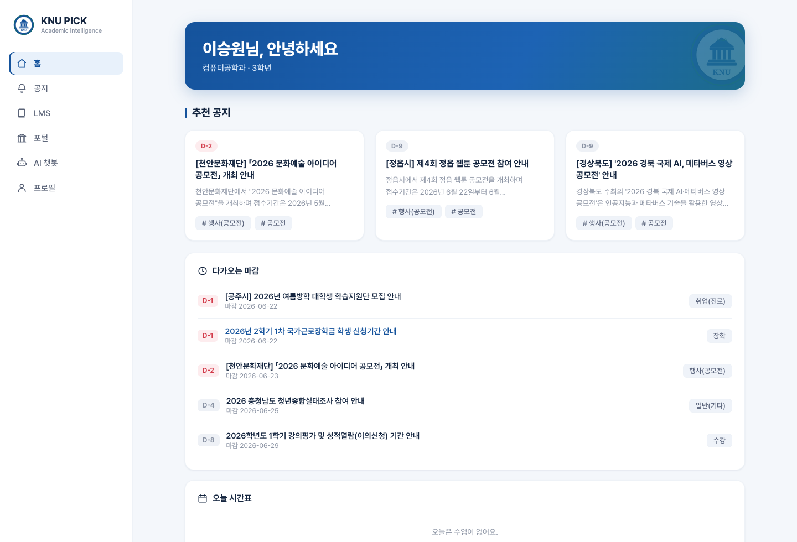

# KNU AI Assistant

> 흩어진 대학 공지와 학사 정보를 한곳에 모아, 학생에게 필요한 정보만 찾아주는 공주대학교 맞춤형 AI 어시스턴트




공주대학교 학생이 공지, 학사 정보, 포털과 LMS 데이터를 한곳에서 확인하고
질문할 수 있도록 만드는 통합 학생지원 서비스입니다.

이 저장소의 중심은 KNU 도메인 데이터와 AI 검색 기능입니다. React 기반의 독립
KNU PICK 웹이 기본 사용자 화면이며, FastAPI 서버가 공지 수집, 학교 서비스 연동,
검색·답변 기능을 제공합니다. Codmes 플러그인은 같은 기능을 다른 클라이언트에서도
사용할 수 있게 하는 별도 선택형 연동 프로젝트입니다.

## 주요 기능

- 공주대 및 학과 공지 수집, 첨부파일 텍스트 추출, 카테고리 분류와 요약
- PostgreSQL·pgvector 기반 공지 검색과 리랭킹, 근거 기반 RAG 답변
- 공주대 포털 로그인과 학적, 시간표, 학점, 성적 정보 동기화
- LMS 과목, 과제, 공지와 미완료 학습 항목 동기화
- 개인화된 공지·학사 정보를 제공하는 KNU PICK 웹
- 외부 AI 클라이언트를 위한 MCP 도구와 Codmes 네이티브 플러그인

## 처리 흐름

1. 학교와 학과 게시판의 공지 및 첨부파일을 수집한다.
2. 문서를 구조화하고 PostgreSQL·pgvector에 검색 가능한 형태로 저장한다.
3. 학생의 학과, 학년과 관심사를 바탕으로 공지 범위를 개인화한다.
4. 질문에 관련된 원문 근거를 검색·재정렬한 뒤 출처와 함께 답한다.
5. LMS와 학사 포털 데이터를 동기화해 할 일, 시간표와 성적 정보를 제공한다.

| 영역 | 기술 |
|---|---|
| Web | React 18, Vite 5 |
| API | FastAPI, Uvicorn, JWT, SSE |
| AI / RAG | LangGraph, LangChain, BGE reranker, LLM·Embedding provider 추상화 |
| Data | PostgreSQL 16, pgvector, HNSW, Redis |
| Background | ARQ Worker |
| Crawling / Sync | Playwright, BeautifulSoup, OCR, 문서 포맷별 extractor |

## 저장소 구조

```text
apps/web/                    KNU PICK React/Vite 웹
services/api/                FastAPI, 데이터 수집·검색, 포털/LMS 동기화, MCP
docs/                        KNUIS·로그인 조사 문서
tools/knuis-debugger/        KNUIS 통신을 확인하는 개발 도구
```

웹과 외부 연동 클라이언트는 `services/api`의 공통 도메인과 저장소를 사용합니다.
클라이언트별 화면 코드는 분리하지만 공지, 사용자, 포털, LMS 데이터 처리 로직은
서버에서 중복 구현하지 않습니다.

## 구성 요소

| 구성 요소 | 역할 |
|---|---|
| KNU PICK Web | 공지, AI 챗봇, 포털, LMS와 사용자 설정을 제공하는 기본 웹 제품 |
| FastAPI | 인증, 도메인 API, 검색·답변 요청과 동기화 작업 진입점 |
| PostgreSQL + pgvector | 사용자·공지·학사 데이터와 검색 벡터 저장 |
| Redis + ARQ | 포털/LMS 동기화와 공지 수집 작업 처리 |
| 수집·검색 파이프라인 | 공지 수집, 첨부 추출, 분류·요약, 임베딩과 리랭킹 |
| MCP | 외부 AI가 공지 검색과 상세 근거 조회를 호출하는 도구 인터페이스 |
| [Codmes KNU plugin](https://github.com/knu-uic/codmes-plugin-knu) | KNU 데이터를 Codmes 네이티브 화면과 AI 도구로 연결하는 별도 선택형 어댑터 |

구체적인 서버 내부 경계는
[API 아키텍처 문서](services/api/docs/architecture.md)를 참고합니다.

## 로컬 개발 조건

각 개발 서버 컴퓨터에는 다음 조건이 충족되어 있어야 합니다.

- Python 3.12 가상환경이 저장소 루트의 `.venv`에 준비되어 있음
- `services/api/.env`가 작성되어 있음
- PostgreSQL 16과 pgvector를 사용할 수 있음
- Redis를 실행할 수 있음
- Node.js와 `apps/web`의 npm 의존성이 설치되어 있음

최초 환경 구성과 환경 변수는
[API 개발 실행 문서](services/api/docs/dev-run.md)와
[`services/api/.env.example`](services/api/.env.example)을 참고합니다.

## 로컬 실행

DB와 Redis를 먼저 실행합니다. 다음 예시는 Docker Compose를 사용하지만 로컬에
직접 설치한 PostgreSQL과 Redis를 사용해도 됩니다.

```sh
cd services/api
docker compose up -d db redis
```

API 서버를 실행합니다.

```sh
cd services/api
source ../../.venv/bin/activate
python -m uvicorn api.main:app --host 127.0.0.1 --port 8000
```

포털/LMS 동기화와 주기적인 공지 수집을 사용하려면 별도 터미널에서 worker를
실행합니다.

```sh
cd services/api
source ../../.venv/bin/activate
arq workers.arq_worker.WorkerSettings
```

마지막으로 KNU PICK 웹을 실행합니다.

```sh
cd apps/web
npm install
npm run dev
```

브라우저에서 `http://localhost:5173`을 열면 됩니다. 웹의 `/api` 요청은 개발
프록시를 통해 `http://127.0.0.1:8000`으로 전달됩니다.

## 데이터와 자격 증명

- 공지, 학적, 시간표, 성적과 LMS 데이터는 KNU 서버의 PostgreSQL에 저장됩니다.
- 포털 비밀번호는 인증과 동기화 요청에만 사용하며 영속 저장하지 않습니다.
- 브라우저 세션과 작업 상태처럼 수명이 짧은 정보는 Redis 또는 임시 저장소를
  사용합니다.
- 운영 환경의 비밀값은 `services/api/.env`에서 관리하며 Git에 커밋하지 않습니다.

## 선택형 연동

### MCP

`services/api`는 외부 AI 클라이언트가 공지 검색과 상세 근거 조회를 사용할 수
있도록 `/api/mcp`를 제공합니다. 도구 호출과 인증 구조는
[운영 실행 문서](services/api/docs/prod-run.md)를 참고합니다.

### Codmes

Codmes 연동은 별도
[knu-uic/codmes-plugin-knu](https://github.com/knu-uic/codmes-plugin-knu)
저장소에서 개발하고 배포합니다. 플러그인은 KNU 웹을 WebView로 열지 않으며,
KNU API의 JSON 데이터를 네이티브 화면으로 표현할 Surface 규약과 MCP 도구 선언을
포함합니다.

플러그인을 개발 중인 Codmes Workspace에 로컬 설치하려면 다음 명령을 사용합니다.

```sh
cd /path/to/Codmes
node bin/codmes.mjs plugin install \
  /path/to/codmes-plugin-knu \
  --root /path/to/CodmesWorkspace
```

일반 사용자는 로컬 경로 대신 Codmes Marketplace에서 KNU 플러그인을 설치합니다.
플러그인 개발, 서명과 Release 절차는 플러그인 저장소에서 관리합니다.
