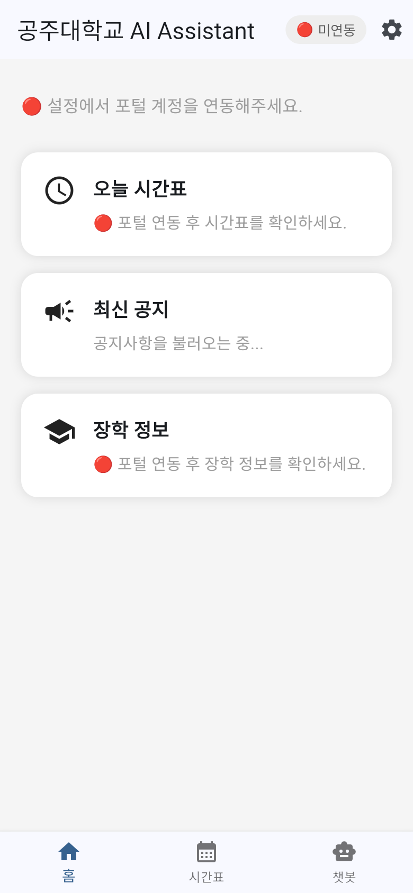
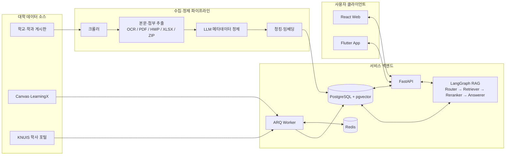

# KNU PICK

> 흩어진 대학 공지와 학사 정보를 한곳에 모아, 학생에게 필요한 정보만 찾아주는 공주대학교 맞춤형 AI 어시스턴트


<table>
  <tr>
    <th width="66%">Web</th>
    <th width="34%">Flutter</th>
  </tr>
  <tr>
    <td></td>
    <td></td>
  </tr>
</table>

## 프로젝트 소개

대학 생활에 필요한 정보는 학교 홈페이지의 여러 게시판, LMS, 학사 포털에 나뉘어 있습니다. 학생은 공지를 매번 확인하고, 긴 본문과 첨부파일에서 자신에게 해당하는 내용을 직접 찾아야 합니다.

KNU PICK은 이 과정을 하나의 서비스로 연결합니다.

1. 학교와 학과 게시판의 공지 및 첨부파일을 수집합니다.
2. 문서를 구조화하고 검색 가능한 벡터 데이터로 저장합니다.
3. 학생의 학과, 학년, 관심사를 바탕으로 필요한 공지를 추천합니다.
4. 질문에는 근거 문서를 검색한 뒤 출처와 함께 답합니다.
5. LMS와 학사 포털을 연동해 할 일, 시간표, 성적 정보를 한 화면에서 보여줍니다.

## 핵심 기능

| 기능 | 사용자 경험 | 구현 포인트 |
| --- | --- | --- |
| 맞춤 공지 | 학과·학년·관심사에 맞는 공지와 마감 임박 정보를 확인 | 공지 메타데이터 정제, 사용자 프로필 기반 필터링 |
| AI 챗봇 | 자연어로 학교 정보를 묻고 관련 원문을 함께 확인 | LangGraph RAG, 벡터 검색, BGE reranking, 근거 중심 답변 |
| 통합 검색 | 장학·수강·취업·행사 공지를 한 번에 탐색 | 카테고리별 문서 저장, pgvector HNSW 검색 |
| LMS 연동 | 강의, 과제, 공지, 미시청 영상을 모아 확인 | Canvas·LearningX 동기화, Redis·ARQ 비동기 작업 |
| 학사 포털 연동 | 시간표, 졸업학점, 성적 현황을 확인 | Playwright 로그인 자동화, 포털 응답 데이터 파싱 |
| 멀티 클라이언트 | 데스크톱 Web과 Flutter 앱에서 동일한 서비스를 이용 | FastAPI 기반 공통 인증·도메인 API |

## 시스템 구조


```mermaid
flowchart LR
    subgraph Sources[대학 데이터 소스]
        Notice[학교·학과 게시판]
        LMS[Canvas·LearningX]
        Portal[KNUIS 학사 포털]
    end

    subgraph Pipeline[수집·정제 파이프라인]
        Crawl[크롤러]
        Extract["본문·첨부 추출<br/>OCR / PDF / HWP / XLSX / ZIP"]
        Refine[LLM 메타데이터 정제]
        Embed[청킹·임베딩]
    end

    subgraph Backend[서비스 백엔드]
        API[FastAPI]
        RAG["LangGraph RAG<br/>Router → Retriever → Reranker → Answerer"]
        Worker[ARQ Worker]
        DB[("PostgreSQL + pgvector")]
        Redis[(Redis)]
    end

    subgraph Clients[사용자 클라이언트]
        Web[React Web]
        App[Flutter App]
    end

    Notice --> Crawl --> Extract --> Refine --> Embed --> DB
    LMS --> Worker
    Portal --> Worker
    Worker <--> Redis
    Worker --> DB
    DB <--> API
    API <--> RAG
    RAG <--> DB
    Web <--> API
    App <--> API
```

### RAG 답변 흐름

```text
사용자 질문
  → Router: 질문을 precise/broad로 분류하고 검색 범위를 결정
  → Retriever: pgvector에서 관련 문서 청크를 검색
  → Reranker: BGE 모델로 질문과 근거의 관련도를 재정렬
  → Answerer: 상위 근거와 원문 맥락을 묶어 답변 생성
  → Verifier(선택): 답변이 근거에 충실한지 검사
```

## 기술적으로 해결한 문제

### 1. 제각각인 대학 문서를 검색 가능한 데이터로 변환

공지의 핵심 정보가 본문이 아닌 이미지나 첨부파일에만 있는 경우가 많습니다. 본문 이미지 OCR과 PDF, HWP/HWPX, XLS/XLSX, ZIP 추출기를 연결하고, 원문과 첨부 텍스트를 구분해 보존했습니다. 표가 청크 경계에서 잘려도 문맥을 잃지 않도록 시트와 헤더 정보를 보강합니다.

### 2. 키워드 일치보다 근거 품질을 우선한 RAG

질문을 단순 검색과 넓은 탐색으로 나누고, 벡터 검색 결과를 reranker로 다시 평가합니다. 답변에는 검색된 청크뿐 아니라 해당 문서의 지원 맥락을 함께 전달해, 짧은 조각만 보고 잘못 답할 가능성을 줄였습니다.

### 3. 느리고 불안정한 외부 연동을 비동기로 분리

LMS와 학사 포털 동기화는 로그인과 외부 응답을 기다려야 하므로 API 요청 안에서 직접 처리하지 않습니다. FastAPI는 작업을 등록하고, ARQ Worker가 실행하며, Redis가 작업 상태와 세션을 관리합니다. 클라이언트는 작업 ID로 진행 상태를 조회합니다.

### 4. Web과 Flutter가 공유하는 일관된 API

인증, 공지, 검색, 챗봇, 프로필, 시간표, LMS 기능을 FastAPI 라우터로 분리했습니다. 두 클라이언트는 같은 도메인 API를 사용하므로 화면별 구현이 서버 규칙을 중복하지 않습니다.

## 기술 스택

| 영역 | 기술 |
| --- | --- |
| Web | React 18, Vite 5 |
| App | Flutter, Dart, Dio, Secure Storage |
| API | FastAPI, Uvicorn, JWT, SSE |
| AI / RAG | LangGraph, LangChain, BGE Reranker, LLM·Embedding provider 추상화 |
| Data | PostgreSQL 16, pgvector, HNSW, Redis |
| Background | ARQ Worker |
| Crawling / Sync | Playwright, BeautifulSoup, OCR, 문서 포맷별 Extractor |
| Infrastructure | Docker Compose, Caddy |

## 저장소 구조

```text
knu-ai-assistant/
├── APP/                         # Flutter 클라이언트
├── WEB/                         # React Web 클라이언트
└── SERVER/
    ├── api/                     # FastAPI 라우터와 인증
    ├── crawlers/                # 학교·학과 게시판 수집
    ├── extractors/              # 이미지·첨부파일 텍스트 추출
    ├── pipelines/               # 수집, 정제, 임베딩 파이프라인
    ├── retrieval/               # LangGraph RAG와 reranker
    ├── sync/                    # LMS·KNUIS 동기화
    ├── workers/                 # ARQ 백그라운드 작업
    └── db/                      # PostgreSQL·pgvector 접근 계층
```

> 최신 통합 구현은 [`dev`](https://github.com/knu-uic/knu-ai-assistant/tree/dev) 브랜치에서 확인할 수 있습니다. `main`은 안정적인 릴리스 기준과 프로젝트 소개를 유지합니다.

## 로컬 실행

최신 통합 환경은 `dev` 브랜치를 기준으로 실행합니다.

```bash
git switch dev

# PostgreSQL + Redis
docker compose -f SERVER/docker-compose.yml up -d db redis

# FastAPI
cd SERVER
RUNTIME_ENV=local ../.venv/bin/python -m uvicorn api.main:app --reload

# ARQ Worker (새 터미널, SERVER 디렉터리)
RUNTIME_ENV=local ../.venv/bin/arq workers.arq_worker.WorkerSettings

# React Web (새 터미널, 저장소 루트 기준)
cd ../WEB
npm install
npm run dev
```

환경 변수와 운영 실행 절차는 [`SERVER/.env.example`](https://github.com/knu-uic/knu-ai-assistant/blob/dev/SERVER/.env.example) 및 [`SERVER/docs`](https://github.com/knu-uic/knu-ai-assistant/tree/dev/SERVER/docs)를 참고하세요.

## 현재 상태

- React Web: 맞춤 홈, 공지, 검색, 챗봇, LMS, 포털 화면과 FastAPI 연동
- Flutter App: 홈, 시간표, 챗봇, 포털 계정 연동 흐름 구현
- Server: 공지 수집·문서 추출·RAG·인증·외부 시스템 동기화 구현
- Branch policy: `main`은 안정 기준, `dev`는 최신 기능 통합 기준
