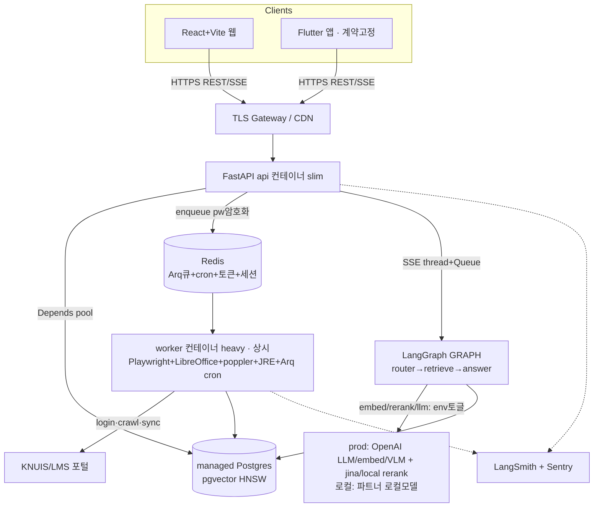

# KNU AI Assistant — FastAPI 상용 아키텍처 설계문서 (rev2)

## Context

기존 Streamlit + 단발 스크립트 기반 RAG(KNU AI Assistant)를 **운영 가능한 FastAPI 서비스 아키텍처**로 마이그레이션한다. 무거운 크롤/연동 배치(Playwright·LibreOffice·OCR·JRE)와 다중 플랫폼 프론트(Flutter 앱 + React 웹)를 안전·효율적으로 제어하는 구조 설계가 목표. 이 문서는 **전체 목표 아키텍처(레퍼런스)**. 구현은 이후 `writing-plans`로 1증분씩 진행.

### 대전제 (절대 위반 금지)
- **`APP/`(Flutter)는 내 담당 아님 — 건드리지·수정제안 금지.** `api_service.dart`는 **고정 계약 입력**으로만 취급, 백엔드를 거기 맞춘다.
- **응답은 dart가 읽는 flat 키 그대로**: `answer, grounded, fidelity, verifier_note, categories, expanded_query, notices` 등. 중첩 금지.
- **에러는 FastAPI 기본 `{"detail": "문자열"}` 유지** — dart `_handleError`가 top-level `detail`을 String으로 읽음(api_service.dart:50). 코드 필요시 문자열 prefix로만.

### 프로바이더 전제
- **prod 기본 = OpenAI** (LLM/임베딩/VLM, `OPENAI_API_KEY`). 리랭커는 코드상 **jina|local**만 존재(config.py:205-212) → 기본 jina, 대안 local.
- 전부 **런타임 env 토글 유지**: `LLM_MODEL`/`EMBEDDING_PROVIDER`/`VLM_PROVIDER`/`RERANKER_PROVIDER`(config.py:189-212). 단일 코드베이스, **프로바이더 하드코딩 금지**. 파트너는 로컬 모델을 로컬에서 돌림.

### 탐색·검증으로 확정된 현재 상태 (라이브 트리 = `SERVER/`)
- **계약 고정**: `api_service.dart` → `:8000` 대상 `/api/health`,`/api/chat`,`/api/notices`,`/api/timetable/{id}`,`/api/user/{id}`,`/api/search`,`/api/portal/sync`.
- **DB 패키지** `SERVER/db/` = `documents.py`,`lms.py`,`users.py`,`schema.py`. `core/`는 커밋 `2ded9e0`에서 **의도적 제거** → 재도입 금지. `SEVER/`(오타)는 중복 잔재.
- **풀 없음**: `SERVER/`에 `psycopg.connect()` **24곳**(documents/lms/users/schema). `register_vector`는 `db/schema.py:50` **단 1곳** → documents.py 등은 register_vector 없이 연결.
- **RAG**: `retrieval/graph.py build_graph()` — LangGraph `router→retriever/broad_retriever→answerer→(verifier)`, **전부 sync**. 스트리밍은 `GRAPH.stream(stream_mode="updates")` 노드 단위.
- **임베딩**: `embedding/embed.py`가 `embedder.embed_documents(chunks)` **배치** 사용(embed.py:113,194). OpenAI 배치 정상.
- **크레덴셜**: 비번 stdin 전달, 저장 안 함. 스케줄러 없음. 무거운 의존성: Playwright/LibreOffice(soffice)/poppler/JRE/VLM OCR.

### 확정된 결정 (사용자)
1. **인증/동기화 = 온디맨드.** 비번은 요청마다 받아 잡 처리에만 쓰고 영속 저장 안 함(상세는 §6 위협모델).
2. **배포 = 클라우드 매니지드(prod).** managed Postgres(pgvector) + 컨테이너 호스팅 + **OpenAI**(env 토글로 local 보존).
3. **산출물 = 전체 목표 아키텍처 설계문서**(이 문서).
4. **웹 = React + Vite SPA.** 기존 Claude Design JSX 재사용.

---

## 10개 관점 결론

### 1. 인증/인가
- **세션 신원(JWT) ↔ 대리로그인 비번(온디맨드) 분리.**
- **채팅은 공개**(B5): `/api/chat`·`/api/chat/stream`·`/api/notices`·`/api/search`는 **인증 불필요** + IP 기반 레이트리밋. JWT 강제는 개인정보 엔드포인트(`/api/user`,`/api/timetable`,`/api/portal/*`)에만.
- **IDOR 방지**(G1): `/api/user/{id}`·`/api/timetable/{id}`는 path에 student_id가 들어감 → **JWT `sub` == path `{id}` 일치 강제(불일치 403)**. 자기 데이터만 조회. 없으면 학생 A의 JWT로 B(`/api/user/20209999`) 조회 가능 = IDOR.
- **JWT 발급 타이밍**(B4): `POST /api/portal/sync`는 워커 로그인 *전에* `202 {job_id}` 반환 → 이 시점 JWT 발급 불가. **JWT는 `GET /api/portal/sync/{job_id}`가 `done`일 때 발급.** 이 폴링 엔드포인트는 닭-달걀이라 **비인증** + **job 소유권 가드**(job_id = 추측불가 토큰, 발급자에게만 반환).
  - ⚠️ **job_id는 사실상 신원 토큰**(done 시 그 student_id JWT 발급) → job_id가 로그 등으로 새면 JWT 탈취 가능. **job_id를 로그/Sentry 스크럽 대상에 포함**(비번과 동급 취급).
- **토큰 관리**: Access JWT 짧게(15~30분, `Authorization: Bearer`). Refresh: 웹=`httpOnly`+`Secure`+`SameSite=Strict` 쿠키 / Flutter=`flutter_secure_storage`. 회전 + Redis 블랙리스트.
- 비번 영속 저장 없음 → **DB 비번 암호화 보관 불필요**.

### 2. 프론트 아키텍처 & API 공유
- **웹 = React + Vite SPA**(확정). 정적 빌드 → nginx/CDN. 챗봇은 SSR 이득 없음 → Next.js 과함.
- **SSOT = FastAPI OpenAPI**. 웹: `openapi-typescript`로 `/openapi.json` → TS 타입 자동생성(계약 변경 즉시 감지). Flutter: 계약 고정 입력이므로 백엔드가 dart에 맞춤(역방향 금지). 개발 중 `/docs` 공유.

### 3. 프로젝트 구조 + ORM 판단 (A1: `core/` 없이, `SERVER/` 기준)
- **ORM 미도입, psycopg3 raw SQL 유지**(분할 테이블·동적 `sql.Identifier`·pgvector·키셋에 raw가 명료, 학습비↓, 프로젝트 메모리 원칙). 웹 레이어는 `db/` 패키지 함수를 호출/async 포팅해 격리.
- **레이아웃**(루트 유틸 평면 유지, `api/`는 얇은 웹 레이어):
```
SERVER/
  config.py                 # 기존 재사용 (providers 포함)
  model.py schema.py integrations.py   # 기존 루트 유틸 (유지)
  db/                       # 기존 패키지
    documents.py users.py lms.py schema.py   # 기존 (async 포팅 대상)
    pool.py                 # 신규: AsyncConnectionPool + register_vector configure
  retrieval/ crawlers/ extractors/ embedding/ sync/ pipelines/   # 기존 그대로
  api/                      # 신규 웹 레이어 (core/ 아님)
    main.py                 # FastAPI + lifespan(pool open/close)
    deps.py                 # Depends: get_conn, get_current_user(JWT), rate_limit
    security.py             # JWT 발급/검증, SecretStr 스크럽
    sse.py                  # thread+asyncio.Queue 브리지 (D11)
    schemas/                # Pydantic v2 — dart flat 키와 1:1
    routers/                # chat notices search users timetable portal health
  workers/
    arq_worker.py           # Arq 워커 + Arq cron(야간 크롤). 상시 실행 (C7,C9)
  migrations/               # 신규: 번호.sql + 러너 (D13)
```
- `security.py`/`deps.py`는 **웹 전용 → `api/`에** 둔다(루트 `core/` 재도입 아님). 도메인 로직은 루트/`db/`/`retrieval/`에 그대로.

### 4. DB 커넥션 풀 (A3: 범위 정직하게 — 가장 긴 작업)
- `requirements.txt`에 `psycopg[binary,pool]` 존재. **AsyncConnectionPool** + 풀 레벨 `configure`로 `register_vector` 1회 등록:
```python
# db/pool.py
from psycopg_pool import AsyncConnectionPool
from pgvector.psycopg import register_vector_async

async def _configure(conn):
    await register_vector_async(conn)

pool = AsyncConnectionPool(conninfo=DB_URL, open=False, min_size=2, max_size=10, configure=_configure)
# api/main.py lifespan: await pool.open() / await pool.close()
# api/deps.py: async def get_conn(): async with pool.connection() as c: yield c
```
- **범위 경고(필수 명시)**: `psycopg.connect()` 호출처 **~24곳**(documents/lms/users/schema). 전부 async 포팅 전까지 **풀 이득 0** — 두 방식 공존 동안 기존 코드는 여전히 connect-storm. → **풀은 1증분이 아니라 가장 긴 작업**. 라우터가 쓰는 읽기 경로부터 async 포팅, 쓰기/크롤 경로는 후속.
- **register_vector 의존성 검증 단계 추가**: documents.py는 현재 register_vector 없이 연결(schema.py:50만 등록). 벡터 읽기 경로(검색 SELECT의 vector 캐스팅)가 register_vector에 의존하는지 **검증 후** async 포팅. 풀 `configure`로 일괄 등록되면 해소되나, 포팅 전 단계에서 회귀 확인 필요.

### 5. 비동기 워커 (C7: 스케줄러 1개)
- **Arq 채택**(async-native + Redis 경량). BackgroundTasks=요청수명 묶임 부적합 / Celery=과함 / RQ=sync.
- **APScheduler 제거** — Arq 내장 **cron 잡**으로 야간 공지 크롤(`ingest.py` 경로, 유저 비번 불필요) 실행. 스케줄러는 하나.
- **임베딩 대량 호출 백오프**: 야간 크롤이 OpenAI 임베딩을 대량 호출 → **429 시 지수 백오프/재시도**(`embedding/embed.py` 위임 계층에 적용, D12 계약 유지).
- **컨테이너 분리**: `api`(웹) / `worker`(무거움: Playwright+chromium, LibreOffice, poppler, JRE, Arq+cron, **상시 실행**) / `redis`(잡큐+토큰+세션) / managed `postgres`.
- **온디맨드 동기화 흐름**:
```
client → POST /api/portal/sync {student_id, password(SecretStr)}
       → api: pw 암호화 후 Arq enqueue → 즉시 202 {job_id}
       → worker: 복호화 → Playwright login → crawl → DB upsert → pw·job 삭제
client → GET /api/portal/sync/{job_id} 폴링 (비인증, 소유권 가드)
       → done 시 결과 + JWT(sub=student_id) 발급 (B4)
```

### 6. RAG 서빙 API
- **스트리밍 = SSE**(WebSocket 아님). EventSource(웹)/dio(앱) 수신 단순, Cloud Run 호환.
- **D11 함정 명시**: `GRAPH.stream`은 **sync 제너레이터**. `anyio.to_thread`는 1회 반환이라 증분 스트리밍 불가. → **별도 thread에서 GRAPH.stream을 돌리고 각 노드 이벤트를 `asyncio.Queue`에 push, async 핸들러가 큐에서 꺼내 SSE yield**(`api/sse.py` 브리지). 토큰 단위는 후속(LangGraph `astream_events` 전환 필요).
```
GET /api/chat/stream?question=...&major=...   (SSE, 공개)
event: step   data: {"node":"retriever","status":"done"}
event: answer data: {"answer":"...", "grounded":true, "fidelity":..., "verifier_note":..., "categories":[...], "expanded_query":"..."}
event: done   data: {}
```
- 비스트리밍 `POST /api/chat`(현 계약) 유지 — 동일 flat 키 반환.
- **SSE 버퍼링 끄기**: 응답 헤더 `X-Accel-Buffering: no`(nginx/프록시 청크 버퍼링 방지). Cloud Run은 기본 OK.
- **페이지네이션**: 공지 목록 = **커서(keyset)** on `(posted_at DESC, id DESC)`. 검색 = top-k offset.
- **에러(A2)**: 전 엔드포인트 `{"detail": "문자열"}`. 코드 필요시 `"PORTAL_LOGIN_FAILED: ..."`처럼 문자열 prefix. FastAPI `exception_handler`로 표준화하되 형태는 dart 호환 유지.

### 7. 보안
- **CORS**: 웹 오리진 allowlist, `allow_credentials=True`.
- **Rate limiting**: `slowapi`(Redis). 공개 채팅은 **IP 기반**(B5), 개인정보 엔드포인트는 JWT 기반.
- **전송/쿠키**: 게이트웨이 TLS 종단(HTTPS·HSTS). Refresh 쿠키 `httpOnly`+`Secure`+**`SameSite=Strict`(CSRF 차단 역할)**. Redis `AUTH`+TLS.
- **비번·신원토큰 보호**: ①로깅 미들웨어 `password` **및 `job_id`(신원 토큰, B4)** 스크럽(로그/Sentry 미전송). ②Pydantic `SecretStr`로 직렬화 노출 차단. ③잡 페이로드 pw 필드 앱키 암호화 + 짧은 TTL + 소비 즉시 삭제.

### B6. 비번 위협 모델 (정직한 표현)
- **"무저장" 아님.** 비번은 Redis 잡 페이로드에 **암호화·짧은 TTL로 단기 보관**되고, 복호화 키도 **워커 env에 동거**. 즉 암호화는 *Redis 단독 덤프/로그 유출*만 막고 *워커 침해 시 전면 노출*은 못 막음.
- 정확한 기술: **"온디맨드 · 단기 큐 보관 · 디스크 미영속 · 사용 즉시 폐기."** 위협모델을 이 수준으로 명시(영속 평문 DB 저장 회피가 목적, 완전 비노출 아님).

### 8. 배포 인프라 (C8 단일 이미지, C9 상시 워커)
- **이미지 1종(prod slim)만**: api 이미지에서 libreoffice/jre/chromium/torch 제외. **로컬 ML 의존성은 배포 이미지가 아니라 파트너 네이티브 venv + `requirements-ml.txt`로 처리**. Dockerfile 빌드 매트릭스 제거.
- **워커는 상시 서비스**(C9): Arq가 Redis 상시 폴링 → **Cloud Run min-instances=1 또는 Fargate service**. 완료형 Cloud Run Jobs 혼용 금지.
- 토폴로지: `api`(Cloud Run/Fargate, SSE) · `worker`(상시, 무거운 이미지) · managed `postgres`(pgvector) · managed `redis`(Memorystore/Upstash). LLM/embed/VLM = **OpenAI**(env 토글), rerank = jina|local.
- 로컬/스테이징 compose: `api | worker | redis | postgres`.

### 9. 관측 (C10: LangSmith 단일)
- **LangSmith로 통일** — 노드별 latency·토큰·트레이스 자동, 설정 한 줄. **자체 `rag_runs` 테이블 미도입**(2인 팀 운영부담 최소).
- **크롤 장애 감지**: 셀렉터 미스/0행을 예외화 → 동기화 잡 결과 `rows_delta`. 급감/연속 실패 시 Slack webhook 알림.
- **에러 트래킹**: Sentry **api·worker DSN/태그 분리**. `before_send`로 비번·**job_id**(B4) 스크럽.

### 10. 최종 스택 & 다이어그램
**스택**: FastAPI(async) · psycopg3 raw + AsyncConnectionPool · Pydantic v2 · **Arq+Redis(내장 cron)** · React+Vite SPA · Flutter(계약 고정) · **모델 env 토글(prod: OpenAI LLM/embed/VLM + jina|local rerank / 로컬: 파트너 native venv)** · managed Postgres+pgvector · SSE(thread+Queue 브리지) · JWT(개인정보 한정, 공개 채팅) · LangSmith + Sentry · raw SQL migrations.



**트레이드오프 요약:**
| 결정 | 이점 | 비용/리스크 |
|---|---|---|
| 온디맨드 · 단기 큐보관 비번 | 영속 평문 저장 회피, 암호보관 불필요 | 야간 자동 유저동기화 불가, 매번 입력, 워커 침해 시 노출 |
| 클라우드 매니지드(prod) + 모델 env토글 | 운영부담↓, prod OpenAI로 GPU 불필요, 로컬 경로 보존 | OpenAI 호출비용↑ |
| raw psycopg3 + 풀 | 분할테이블·pgvector 명료 | **24곳 async 포팅 = 최장 작업**, 공존기간 풀 이득 0 |
| Arq(내장 cron) | async 자연, 스케줄러 1개 | Redis 1개 추가, 상시 워커 필요 |
| React+Vite SPA | JSX 재사용, 단순 | SSR/SEO 없음(챗봇 무관) |
| 채팅 공개 + 개인정보만 JWT | UX 마찰↓(채팅에 로그인 강제 안 함) | 공개 엔드포인트 IP 레이트리밋 필수 |

---

## D13. 마이그레이션 전략 (Alembic 없음)
ORM 미사용 = Alembic 없음. managed Postgres는 drop-recreate 불가 → **raw SQL `migrations/` + 간단한 러너**: 번호 붙인 `.sql`(`001_init.sql`, `002_*.sql`)을 순서대로, **아직 안 돌린 것만** 적용(`schema_migrations` 추적 테이블). 신규 스키마 변경은 이 골격으로 처리.
- **경계(G2)**: `migrations/`는 **정적 스키마만**(고정 테이블·인덱스·refresh 토큰 등). **카테고리별 `document_<slug>` 분할 테이블은 기존대로 런타임 동적 생성**(`db` `_doc_ident`/`sql.Identifier`) 유지 — **migration 대상 아님**. 둘을 섞지 않는다.

## 산출물 & 다음 단계
1. (완료) 이 설계를 `docs/superpowers/specs/2026-06-05-fastapi-migration-architecture-design.md`로 저장.
2. **첫 증분**을 `writing-plans`로 분리: **FastAPI 코어 + AsyncConnectionPool + `/api/health` + `/api/chat`(비스트림, 기존 GRAPH 재사용)**. 코드 작성 전 CLAUDE.md 5.2 work-start 프로토콜(이슈 생성·브랜치) 수행.
3. 이후 증분(각 1브랜치=1행동): db 읽기경로 async 포팅 → **migrations 골격(첫 스키마 변경 전 러너 확보)** → SSE `/api/chat/stream`(thread+Queue) → `/api/notices` 키셋(필요 인덱스는 migrations로) → JWT(개인정보 한정) → `/api/portal/sync` Arq 잡+상시 워커 분리 → LangSmith/Sentry → 웹 SPA 연결.
   - **migrations 골격을 JWT/portal·notices보다 앞에** 둠: keyset 인덱스·refresh 토큰 테이블 등 첫 스키마 변경이 러너 위에서 일어나도록.

## Verification (첫 증분)
- `docker compose up api db` 후 `curl /api/health` 200.
- `curl -X POST /api/chat -d '{"question":"장학금 신청 언제야","major":"..."}'` → 기존 GRAPH와 동일 결과(회귀 없음), **응답 flat 키**(answer/grounded/...) 확인.
- **풀 누수 점검**: 반복 요청 후 `SELECT count(*) FROM pg_stat_activity WHERE datname=current_database();` 커넥션 수 안정(증가 후 max_size 이하 수렴, 누수 없음) 확인.
- 임베딩 호출은 `embedding/embed.py` 위임 그대로(D12) — api/worker에서 배치 재구현 안 함.
